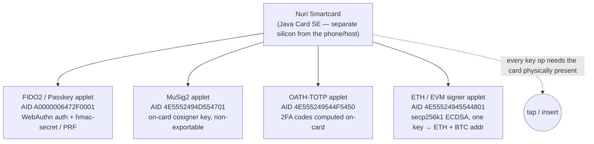
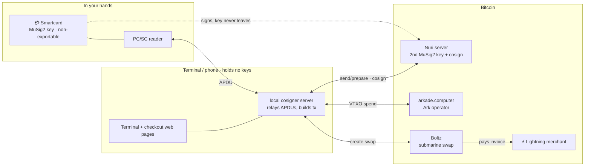
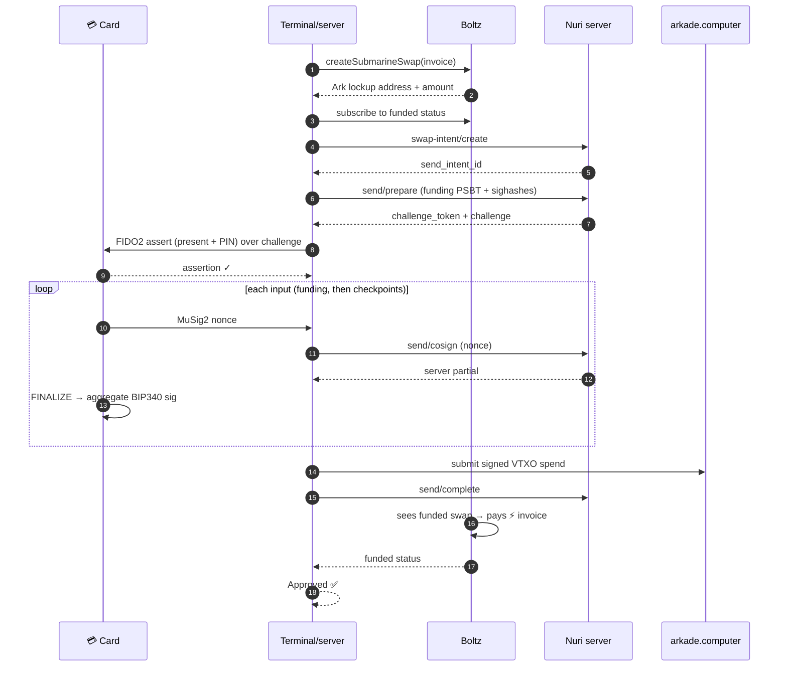
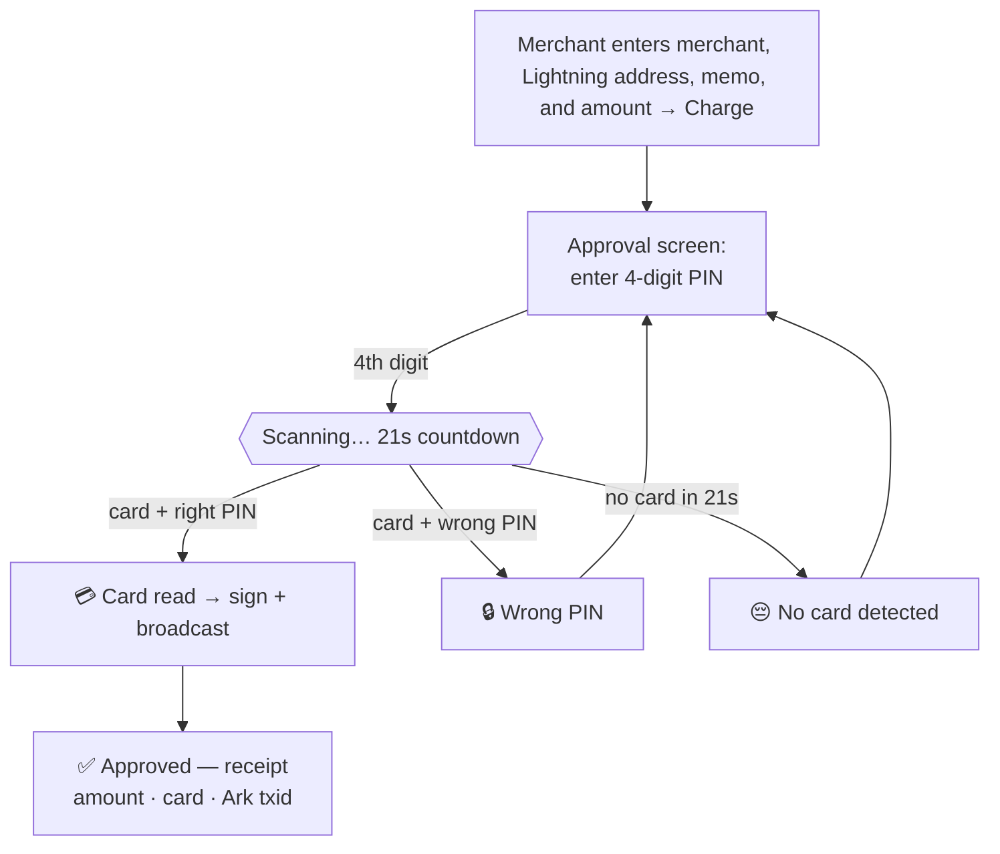
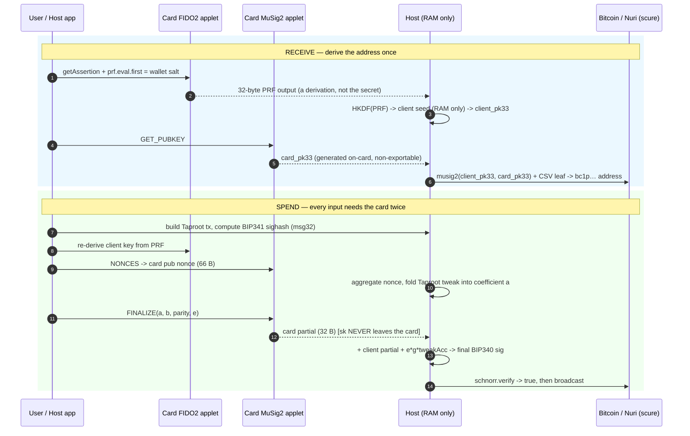
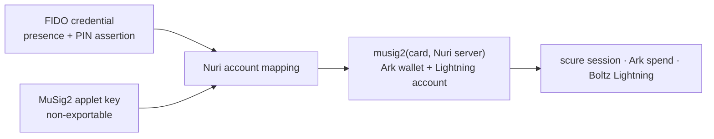

# Nuri Passkey PRF Smartcard

**A smartcard that is both a passkey and a non-exportable Bitcoin MuSig2 signer, linked explicitly to a live Nuri/Arkade account.**

MIT-licensed, open hardware-wallet research proven on a physical Feitian Java
Card: the card co-signed live Bitcoin transactions, signed an Ark transaction
over Android NFC, and authenticates over WebAuthn like a passkey.
The live card flow keeps the FIDO credential and MuSig2 wallet key separate and
verifies their server mapping; see the [2026-07-10 incident report](docs/expo-web-parity-incident-2026-07-10.md).

---

## Table of contents

- [The vision](#the-vision)
- [What it is today](#what-it-is-today)
- [Proven on a real card](#proven-on-a-real-card)
- [**Bitcoin debit card: tap-to-pay Lightning** (the flagship demo)](#bitcoin-debit-card-tap-to-pay-lightning-arkade--nuri)
- [Expo/web parity incident and fix (2026-07-10)](docs/expo-web-parity-incident-2026-07-10.md)
- [Status & latest findings](#status--latest-findings-2026-07-10)
- [How it works](#how-it-works)
- [Same wallet as the Nuri app (PWA / nuri-expo)](#same-wallet-as-the-nuri-app-pwa-nuri-expo)
- [Where it sits vs other hardware wallets](#where-it-sits-vs-other-hardware-wallets)
- [Roadmap to the vision](#roadmap-to-the-vision)
- [Quick start](#quick-start)
- [From scratch: clone, install, run your own card](#from-scratch-clone-install-run-your-own-card)
- [Capability reference](#capability-reference)
- [SSH with the smartcard](#fido2-ssh-security-key)
- [Ethereum / EVM signing](#ethereum-evm-signing)
- [Security model & caveats — read this before trusting the card with real funds](#security-model--caveats--read-this-before-trusting-the-card-with-real-funds)
- [Hardware: which card to buy](#hardware-which-card-to-buy)
- [Flashing a real card](#flashing-a-real-card)
- [What we can and cannot claim](#what-we-can-and-cannot-claim)
- [Repo layout & references](#repo-layout-references)

---

## The vision

Today a self-custody Bitcoin user juggles a phone wallet, a seed phrase, and — if
they are careful — a separate hardware signer. Three things to lose, back up, and
trust.

**Nuri's bet: collapse all of that into one card you can put your finger on.**

The card is, at once:

- your **passkey** (FIDO2/WebAuthn — log into Nuri and any RP that speaks passkeys),
- your **Bitcoin signer** (a MuSig2 cosigner key generated on-card, non-exportable),
- and an **account authenticator** whose FIDO credential is explicitly mapped to
  the separate MuSig2 wallet key.

The current tested payment authorization uses the card's FIDO2 PIN. Match-on-card
fingerprint authorization is the intended hardware path but is not integrated
into the custom signing flow yet. No seed phrase is exported; recovery is a
published, deterministic time-locked Bitcoin script.

The direction this is heading — the part worth building toward:

> **A wallet where the card is enough.** Tap the card to a phone or a Bitcoin
> point-of-sale terminal and pay, the way a Boltcard taps for Lightning or a
> contactless debit card taps at a checkout — but backed by your own keys and a
> real on-chain/Arkade wallet, not a custodial balance. Eventually: leave the
> phone at home.

The last mile is now **built and proven on mainnet**: a Visa-style terminal where
you tap the card, enter a PIN, and pay a Lightning invoice from a self-custodial
Bitcoin (Ark) balance — the card signs, no custodian can move the funds. See
[Bitcoin debit card: tap-to-pay Lightning](#bitcoin-debit-card-tap-to-pay-lightning-arkade--nuri).
The remaining vision item is a *phone-optional* standalone terminal (today a
laptop + reader drives it); see [Roadmap](#roadmap-to-the-vision).

This grew out of the same lineage as [Bitkey](https://bitkey.world),
[Keycard](https://keycard.tech), [Tangem](https://tangem.com),
[Satochip](https://satochip.io), [Tapsigner](https://tapsigner.com) and
[Boltcard](https://boltcard.org) — see [the comparison](#where-it-sits-vs-other-hardware-wallets)
for where it diverges.

---

## What it is today

One physical card, a secure element running **four independent applets**, each
behind its own AID, plus a full host-side toolkit that turns the card into a real
Bitcoin wallet.



| Track | What the card does | Status |
|---|---|---|
| **FIDO2 + WebAuthn PRF** | Acts as a passkey authenticator; CTAP2 `hmac-secret` gives WebAuthn `prf`. Patched so **every** passkey is PRF-capable. | ✅ Real-card proven (PC/SC + native NFC) |
| **Bitcoin MuSig2 cosigner** | Generates a secp256k1 cosigner key on-card, returns only the pubkey, signs MuSig2 partials. | ✅ Real-card proven (live signet tx) |
| **Card-as-wallet** | `musig2(client, card)` Taproot wallet with a client+CSV recovery leaf — looks like one key on-chain. | ✅ Real signet + mainnet addresses |
| **Arkade / Lightning identity** | Card PRF is the root of the Nuri/Arkade client key; supports the VTXO tree-round tweak. | ✅ Key + tweak proven; Ark→Lightning **send + receive now wired** (see [Bitcoin debit card](#bitcoin-debit-card-tap-to-pay-lightning-arkade--nuri)) |
| **OATH-TOTP** | Stores a 2FA secret, computes HMAC-SHA1 on-card (e.g. Hetzner). Secret never read back. | ✅ Real-card, RFC 6238 verified |
| **FIDO2 SSH security key** | Use the card as an OpenSSH `sk-ecdsa-sha2-nistp256` hardware key. Private key never leaves the card; every sign requires a tap. Provider bridge + one-command installer + full docs. | ✅ Real-card proven (live login to root@89.167.91.99) |
| **Ethereum / EVM signing** | secp256k1 ECDSA signing on-card. One key → ETH address (keccak256) + BTC P2PKH address (hash160). Card signs, host verifies. **v1.3 proven: 5/5 ecrecover via `python-ecdsa`.** | ✅ Real-card proven (ecrecover green) |
| **Fingerprint unlock (match-on-card)** | Replace PIN with a fingerprint. Feitian confirms the API; SDK is NDA-gated. | 🔒 Hardware path identified, not integrated |
| **Tap-to-pay Lightning terminal** | Visa-style terminal: tap card + PIN → pay a Lightning invoice from the card's live Ark balance. Card signs (MuSig2), terminal holds no keys, Nuri supplies the second partial. | ✅ **Android NFC signing + Ark broadcast proven on mainnet**. Fresh proof and exact remaining boundary: [2026-07-10 incident report](docs/expo-web-parity-incident-2026-07-10.md). |

Two design rules hold throughout:

1. **The private keys never leave the card.** There is no "export key" APDU
   anywhere. The cosigner key is generated on-card; the passkey secret only ever
   emits a one-way PRF derivation.
2. **The Bitcoin signer and the FIDO2 authenticator are separate applets.** A bug
   or reset in the passkey path cannot touch the Bitcoin key, and vice-versa.

---

## Proven on a real card

These are not simulations. A physical Feitian BioCARD sample, two custom applets
installed side by side, did the following:

- **Co-signed a live Bitcoin Signet transaction**, broadcast and confirmed in
  block `308802`:
  [`d9ecca378bd015f2bd39d3113d3dadc65e6b6f29b72c1d1e6a7d73f246994c38`](https://mempool.space/signet/tx/d9ecca378bd015f2bd39d3113d3dadc65e6b6f29b72c1d1e6a7d73f246994c38)
  — 1337 sats, `OP_RETURN "Nuri.com"`, change back to the card wallet. A second
  confirmed run landed in block `308804`
  (`c85a73fab75f8649852123d1fff336df2f098792554086a290433ce0999c3e81`).
- **Generated its MuSig2 cosigner key on-card** (`INS_KEYGEN`) and returned only
  `card_pubkey33`; the host suite verified `key_origin: on_card_keygen_non_exportable`,
  `card_partial_verified: true`, `final_signature_verified: true`.
- **Derived a stable Nuri Taproot wallet address** that is identical across
  re-runs (signet `tb1pywzzgk3p7a5zhhkpqn548pm0xpqqfvzl4jylev522glcjy5npc4sckt9fa`),
  and a real **mainnet** address via the same path.
- **Passed real WebAuthn PRF** over PC/SC and native NFC (`REAL_CARD_WEBAUTHN_PRF_OK`),
  returning two 32-byte `hmac-secret` outputs.
- **Derived the Nuri/Arkade client identity key** byte-for-byte identically to the
  phone (`CARD_ARKADE_IDENTITY_STABLE_OK`).
- **Logged into a real server over SSH** using the card as a hardware key
  (`ssh nuri-wirex` → `root@89.167.91.99`, confirmed 2026-07-05). The private
  key never left the card; every login required a tap.

Full transcripts and explorer links: [`docs/real-card-signet-proof.md`](docs/real-card-signet-proof.md),
[`docs/nuri-card-wallet-proof-report.md`](docs/nuri-card-wallet-proof-report.md),
[`docs/logs/`](docs/logs).

Reproduce the host-side proofs (no card needed) and the real-card proofs (card
inserted) with the commands in [Capability reference](#capability-reference).

---

## Bitcoin debit card: tap-to-pay Lightning (Arkade + Nuri)

**The card is a real Bitcoin debit card.** You tap it on a reader, enter a PIN,
and it pays a Lightning invoice from a Bitcoin (Ark) balance — the same UX as a
Visa contactless payment, but the "bank" is the Arkade network and the "chip"
is a smartcard holding a MuSig2 key that **never leaves the card**.

This was proven end-to-end on **mainnet** (2026-07-07): a card-signed payment of
400 sats to `emin@nuri.com` funded a Boltz submarine swap and settled over
Lightning (`ark_txid e6af75b5…`, `NURI_CARD_ARKADE_SEND_OK`).

> **New here? Read [docs/how-it-works.md](docs/how-it-works.md)** — a plain-English,
> end-to-end walkthrough of what the card does, how the terminal and profile work,
> why it was hard, and why a self-custodial tap-to-pay Bitcoin card is genuinely new.

### The pieces, at a glance



The card + Nuri hold one MuSig2 key each: **2-of-2, neither side can move funds
alone**. The terminal and server hold **no** keys — they only relay and build.

### The live card account

The profile and terminal now expose one real account: the wallet derived from
the **inserted card's MuSig2 public key** and the live Nuri server public key.
They do not offer a locally simulated second signer and do not substitute a
remembered username, address, or balance.

The physical card tested on 2026-07-10 returned:

```text
card_client_pk33 = 02b9f7051445e003e60809f888ccca2057dba6609e5c5541eee64acef41ddbf034
Lightning address = smartcard@nuri.com
```

Those values are evidence for that card/profile pair, not application defaults.
Every run reads the card key over APDU and obtains the Lightning account through
an authenticated server request.

### What works today (all on real hardware, mainnet)

- **Receive** to the username returned by authenticated LNURL status; the
  2026-07-10 test profile returned `smartcard@nuri.com`.
- **Auto-claim**: the profile page polls for inbound reverse swaps and claims
  them into the card's Ark balance (card taps to co-sign the VHTLC claim).
- **Send**: `swap-intent/create → send/prepare → card FIDO2 UV assertion →
  send/cosign (MuSig2 round) → Ark broadcast → send/complete → funded status`.
  The app surfaces failures instead of converting them into success data.
- **Terminal checkout**: a Visa-style payment terminal (`/checkout`) — amount,
  merchant, Lightning address, memo, PIN, "tap card & approve" → real broadcast
  + receipt.

The 2026-07-10 Android transaction proves this flow through indexed Ark
broadcast. The monitor was then moved ahead of broadcast and `send/complete`
was made mandatory in both Expo and the desktop runner. A fresh payment is
still required to prove that final ordering through funded status and
merchant-confirmed Lightning settlement; the UI labels funded and settled as
different states.

### How the send works (the part that was hard)

The card's Ark funds are locked to `musig2(card, second-key)`, so **spending
needs both signatures**. The flow:

```
sendLightningPayment (Arkade SDK, arkade.computer)
  ├─ createSubmarineSwap (Boltz)         → Ark lockup address + expectedAmount
  ├─ start waitForSwapFunded monitor     → subscribe before broadcast
  ├─ swap-intent/create (Nuri)           → send_intent_id
  ├─ wallet.send() spends the card VTXO into the lockup:
  │    identity.sign():
  │      ├─ send/prepare (funding PSBT + sign_requests) → challenge_token
  │      ├─ ONE card FIDO2 UV assertion over the challenge  (PIN + tap)
  │      └─ per input: card MuSig2 nonce → send/cosign → server partial
  │                    → card FINALIZE (APDU) → aggregate BIP340 sig
  │         (funding cosign is strict; checkpoint txs are follow-ups
  │          under the same challenge_token, route_scope=direct_send_session)
  ├─ send/complete                       → record the returned Ark txid
  └─ require funded status               → Boltz pays the merchant's BOLT11 invoice
```

Same thing as a sequence — one PIN+tap, then the 2-of-2 signing round:



The server re-derives every `msg32` from the PSBT (`verifyArkadePsbtSignRequests`)
and the card signs that exact sighash — so the aggregate signature the card +
server produce is valid for the real VTXO spend. The card only ever does two
things: a FIDO2 UV assertion (presence + PIN) and MuSig2 `GET_NONCES` +
`FINALIZE`. It never exports a key, never parses the transaction, never learns
the amount or recipient.

### At the terminal (what the customer sees)



The scan waits for the physical card for up to 21 seconds. Signing, broadcast,
completion, and funded status are reported as separate steps.

### Run the wallet + terminal locally

```bash
# 1. Physical card in the reader. Supply the exact profile and live services:
export NURI_CARD_RECEIVE_PROFILE=<exact-profile-name>
export NURI_CARD_RECEIVE_PROFILE_PATH=/absolute/path/to/profile.json
export NURI_ARKADE_SIGNER_URL=https://your-live-arkade-v4.example/v4
export EXPO_PUBLIC_NODE_URL=https://your-live-ark-node.example
export FIDO2_BACKUP_PIN=<your-card-pin>
npm run checkout:web
#   serves http://127.0.0.1:8787  (profile, terminal, checkout pages)

# 2. Claim a Lightning username for this exact card/profile pair:
node scripts/card-nuri-lnurl-register.mjs <username> \
  --profile <exact-profile-name> \
  --profile-path /absolute/path/to/profile.json \
  --arkade-url https://your-live-arkade-v4.example/v4 \
  --pin <pin>
# The command returns the live Lightning address and physical card key.

# 3. Open the pages:
#   http://127.0.0.1:8787/profile    — live balance, receive, auto-claim, username
#   http://127.0.0.1:8787/terminal   — merchant: enter amount + a Lightning address
#   → generates a /checkout?id=… link = the Visa-style tap-to-pay terminal
```

Direct CLI send (no browser), for scripting/tests:

```bash
# Nuri account: prints NURI_CARD_ARKADE_SEND_OK on success
echo '{"mode":"send", ...cfg... }' | node scripts/card-arkade-claim.mjs
# see payMerchantInvoice() in scripts/local-card-cosign-server.mjs.
```

### Reproduce from scratch (including the card)

1. Flash the card's applets and set a PIN — see
   [From scratch: clone, install, run your own card](#from-scratch-clone-install-run-your-own-card)
   (FIDO2/PRF applet + MuSig2 cosigner applet, then `npm run card:pin:set`).
2. Enroll the card's Arkade receive credential (creates
   `.nuri-card-prf/nuri-card-arkade-receive.json`): `npm run card:prf:enroll`
   with the `nuri-card-arkade-receive` profile.
3. Start the server (`npm run checkout:web`) and open `/profile`; click
   **Register owner** to register the card as a Nuri Arkade receive owner.
4. Claim a username with the explicit registration command above, fund it by
   paying the BOLT11 minted by the profile page, and let auto-claim pull it in.
5. Send: use the terminal, or the CLI runner above.

Requirements: a smartcard with the Nuri applets + a PC/SC reader (tested on an
**HID OMNIKEY 5422**), Node 20+, and the real-card Python venv (see
[host dependencies](#1-clone-and-install-host-dependencies)). The Nuri server
service URLs are supplied explicitly at runtime. The URLs above are examples,
not embedded account or identity defaults.

### Security model (money at stake)

- The card's secp256k1 key is generated on-card and **non-exportable**. Every
  spend needs a physical tap; every FIDO2 UV assertion needs the PIN.
- The Nuri server is a **co-signer, not a custodian** — it holds one MuSig2 key
  of a 2-of-2 and can never move funds alone. Its cosign is gated by a card
  WebAuthn assertion over the specific payment. The recovery path lets the card
  exit unilaterally after a CSV timeout, so the server cannot lock you out.
- The terminal/phone relays APDUs and builds the transaction, but holds **no**
  key material.
- Caveat: today the on-card MuSig2 nonce/sign APDUs are not yet PIN/UV-gated on
  the applet itself — presence is enforced by the reader + the FIDO2 assertion
  in the flow, not by the signing applet. Hardening that is on the roadmap.

---

## Status & latest findings (2026-07-10)

Running session notes live in [`docs/logbook.md`](docs/logbook.md); release log in
[`CHANGELOG.md`](CHANGELOG.md). Headlines:

- **✅ Android NFC MuSig2 signing and Ark broadcast are live-proven.** On
  2026-07-10 the inserted card and live Nuri server produced two verified
  partial-signature pairs and two verified aggregate BIP340 signatures. Ark tx
  `965a299bcf8b788eb0ef23896323c4ed97133836e84df19fffcbbcd63a33cc1a`
  is returned by the live indexer. Hardcoded identity/balance data, the duplicate
  Expo session math, stale CTAP options, and the obsolete send payload were
  removed. The post-broadcast monitor now subscribes before broadcast and
  `send/complete` is fail-closed. That final ordering still needs one fresh real
  payment to prove completion and merchant settlement. Full root-cause report:
  [`docs/expo-web-parity-incident-2026-07-10.md`](docs/expo-web-parity-incident-2026-07-10.md).
- **The card is a real SSH hardware key.** `ssh nuri-wirex` → logged into
  `root@89.167.91.99` (Hetzner) using only the card. Private key generated
  on-card, never exported; every login required a tap. One-command installer
  (`scripts/install-ssh-card-host.sh`) + full docs
  ([`docs/ssh-smartcard.md`](docs/ssh-smartcard.md)). See
  [SSH with the smartcard](#fido2-ssh-security-key) below.
- **One card can be the whole wallet.** [`web/card-wallet.html`](web/card-wallet.html)
  + `POST /api/wallet/{address,utxos,spend}`: client key from the card's FIDO2 PRF,
  cosigner from the same card's MuSig2 applet — `musig2(client,card)` + CSV(52500).
  Proven end-to-end on **mainnet** via the reader (`npm run cosign:web` →
  `http://localhost:8787/wallet`).
- **FIDO2 user-presence fix** ([`dist/FIDO2-up.cap`](dist/FIDO2-up.cap),
  [`patches/0002`](patches/0002-advertise-user-presence.patch)): the applet
  advertised `up:false`, so browsers refused it; advertising `up:true` (the applet
  already sets `UP=1`) makes Safari/Chrome accept the card. Verified on hardware.
  Details: [`docs/fido2-user-presence.md`](docs/fido2-user-presence.md).
- **secp256k1 is card-OS-gated.** MuSig2/Bitcoin works only on cards with OS
  **`2025-05-14`** (ATR `3b:81:80:01:80:80`). The `2023-03-30` OS lacks the EC
  point-multiply (`ALG_EC_SVDP_DH_PLAIN_XY`) → keygen returns `6A81`. The OS is
  mask-ROM — **not user-updatable**. Same model number is not enough; screen each
  batch (`gp -i` OS date, then `npm run cosign:real-card:keygen`).
- **Browser PRF is a macOS dead-end (platform, not card).** The card enables
  `hmac-secret` (assertion ED flag true), but **Safari returns `prf:null` for
  external security keys**, and Chrome can't see a PC/SC contact reader. Browser
  PRF works only via a native-NFC app or Windows. Card-as-passkey *login* works.
- **"gp can't find the reader" was a broken gp snapshot build — not macOS, not
  the reader, not the card.** The official release (v26.06.04) worked first try
  and installed the ETH signer. Rules learned the hard way: only use gp
  *release* jars; never hand-roll SCP02 against the ISD (failed auths can brick
  it); force **T=0** on the OMNIKEY 5422 contact slot; never kill a process
  mid-APDU on macOS (it wedges PC/SC system-wide until the card is re-seated).
  Full post-mortem: [`docs/gp-macos-troubleshooting.md`](docs/gp-macos-troubleshooting.md).
- **ETH signer v1.0 hung on every SIGN — an infinite loop in the applet's
  software `modInverse`** (plus wrong-endian parity checks and a broken
  odd-value halving). A mute card + wedged macOS PC/SC stack *looks like* a
  reader/OS bug; it was applet code. v1.1 fixes the algorithm (verified
  off-card against `pow(a,-1,n)` for 5000+ inputs first). Same doc, section
  "Resolved: INS_SIGN".
- **ETH signer v1.0–v1.2 produced wrong ECDSA signatures** (valid sig for the
  wrong key Q, Q ≠ keygen pubkey, Q varied per call). `BigIntegerWrapper.addMod`
  was not aliasing-safe when `result == b`: the `Util.arrayCopy(a, result)`
  prologue clobbered `b` before it was read, so `addMod(z, rd, rd)` computed
  `2z` instead of `z+rd` — every signature had wrong `s`. v1.3 makes
  `addMod`/`subMod` index-by-index (aliasing-safe). Verified end-to-end:
  `keygen → sign(5 hashes) → ecrecover → matches card pubkey` (5/5, v-bit
  correct, low-s enforced). Same doc, section "Resolved: INS_SIGN produced
  wrong signatures".

---

## How it works

The wallet is a **2-of-2 MuSig2 key that looks like one ordinary Taproot address
on-chain**, with a time-locked recovery leaf so a lost card never means lost coins.
Both halves involve the card; the host only ever handles public data and a one-way
PRF derivation.



Two things make this work cleanly:

- **The card never parses Bitcoin.** The host (`@scure/btc-signer`) builds the
  transaction, the session, and the Taproot tweak. The card only protects keys and
  returns a partial. Smallest possible audit surface.
- **The Taproot tweak is host-side**, exactly where BIP327 puts it (folded into the
  coefficient `a` and a final `e·g·tweakAcc` term). So the card runs plain MuSig2
  (`s = k + e·a·sk`) and its signature is **byte-compatible with `sign.nuri.com`** —
  no applet change needed to sign for the tweaked output key.

Full Mermaid walkthrough, the PRF→client-key step, and a phone-software-key /
phone-TEE / smartcard threat-model comparison:
[`docs/card-architecture.md`](docs/card-architecture.md).

---

## Same wallet as the Nuri app (PWA / nuri-expo)

The live card flow uses two separate applets and two separate identifiers:

- the **FIDO credential** authorizes account operations with card presence and
  PIN; and
- the **MuSig2 applet key** is the Arkade client signer that owns the wallet
  together with the Nuri server key.

The server explicitly maps the credential to the card client key. The same FIDO
credential ID does **not** mathematically guarantee the same MuSig2 key or wallet
address. Reinstalling/regenerating one applet, selecting another profile, or
using another physical card can change one side without changing the other.

That distinction is the central lesson from the 2026-07-10 incident. The app
must read both identities and verify their live mapping; it must never infer a
wallet or username from a remembered credential name.



The older PRF compatibility commands remain research tools. They prove a card
PRF can reproduce a software derivation, but they are not the spend identity in
the live NFC card flow described here.

Status and the exact wiring point: [`docs/arkade-lightning.md`](docs/arkade-lightning.md).

---

## Where it sits vs other hardware wallets

| | Form | Unlock | Signing model | Open | Same-as-app wallet | Tap-to-pay |
|---|---|---|---|---|---|---|
| **Nuri card** | NFC smartcard | PIN-authorized FIDO assertion today; fingerprint integration pending | **MuSig2 2-of-2**, looks like 1 key, CSV recovery | ✅ MIT host | Live credential-to-card mapping | ✅ Android NFC signing + Ark broadcast proven |
| Bitkey | fob + phone + server | phone biometric | 2-of-3 multisig | ✅ | app-paired | no |
| Keycard | NFC smartcard | PIN | single-key BIP32 | ✅ | no (separate keys) | no |
| Tangem | NFC card | card + phone | single-key (2/3 backup) | partial | no | no |
| Satochip | NFC/contact card | PIN | single-key; MuSig2 on a beta branch | ✅ (AGPL) | no | no |
| Tapsigner | NFC card | PIN/CVC | single-key | closed | no | no |
| Boltcard | NFC card | — | **not a signer** (LNURLW custodial tap) | ✅ | no | ✅ Lightning |

What is genuinely different here:

- **The card is both authenticator and wallet signer.** The FIDO applet proves
  presence/PIN; the separate MuSig2 applet signs Bitcoin. The live server binds
  those two identities explicitly instead of pretending they are one key.
- **Fingerprint instead of PIN**, on a card you tap — Bitkey-class biometrics in a
  card form factor.
- **MuSig2 key-path Taproot** — one key on-chain, full privacy, with a deterministic
  CSV recovery leaf instead of a seed-phrase backup. Boltcard gives you the tap but
  not the keys; Keycard/Tapsigner give you the keys but not the tap or the app-wallet
  identity. Nuri delivers both ends — a self-custodial tap-to-pay Lightning card,
  proven on mainnet.

---

## Roadmap to the vision

Honest scope, eyes open. The friend-conversation question — *"can a hardware wallet
add a layer of security if the Nuri server is gone, and can the card eventually
replace the phone?"* — breaks into these tracks:

**1. Card as an independent signer (server-optional) — _done in this repo._**
The standalone `musig2(client, card)` wallet already signs real Bitcoin with no
server. Wiring it into nuri-expo behind a `card` cosigner flag is the next app-side
task (the `SigningKeyVault` swap above).

**2. Hardware-wallet co-signer (Trezor / Coldcard-style) — _Taproot leaf, not 3rd MuSig2 party._**
Production MuSig2 on mainstream hardware wallets is still thin (the two-round nonce
protocol is dangerous on constrained devices), and a phone+server+HW MuSig2 would be
3-of-3 — needed every tx, wrong UX. The feasible path is to add the HW wallet as an
**extra Taproot script leaf** (`client + hardware`) alongside the MuSig2 key-path and
the CSV recovery leaf. Server-independent, no CSV wait, and HW wallets support
Taproot script-path multisig *today*. Keep any new leaf **deterministic from the HW
pubkey + published policy**, same trick as v4, so no opaque backup data returns.
FROST is the longer-term threshold option.

**3. Fingerprint UV in our own applet — _needs the NDA SDK._**
Feitian confirms a Java applet can call the match-on-card fingerprint API to gate a
private-key operation, but the BioCARD SDK is NDA-gated. Until then: FIDO2 PIN/UV, or
Feitian's preloaded biometric FIDO2 stack.

**4. Tap-to-pay Lightning — _Android NFC signing and Ark broadcast proven._**
A Visa-style terminal fetches the invoice, builds the tx, gets the card's
signature (2-of-2 MuSig2), and broadcasts; the card holds the key and the PIN is
enforced by the reader + the FIDO2 UV assertion in the flow. Real card-signed
Ark→Lightning payments use the Nuri cosigner and Boltz. The latest Android run
verified both partials and final signatures and broadcast an indexed Ark
transaction. See [Bitcoin debit card](#bitcoin-debit-card-tap-to-pay-lightning-arkade--nuri)
and the [2026-07-10 incident report](docs/expo-web-parity-incident-2026-07-10.md).

**Open verification and hardening items:**
1. A *phone-optional standalone* POS terminal (Scenario B) — today a laptop +
   PC/SC reader drives it.
2. PIN-gating the MuSig2 nonce/sign APDU on the applet itself — today presence +
   PIN are enforced by the reader + the FIDO2 assertion in the flow, not by the
   signing applet.
3. Re-run a real Android payment after the final pre-subscription and
   `send/complete` ordering change, then confirm Lightning settlement.
4. Prove the equivalent CoreNFC flow on a physical iPhone.

There is **no "card alone with no internet device" scenario** — the card
cannot broadcast, no hardware wallet can. The realistic paths are:
- **Scenario C (✅ built + proven on mainnet):** your card + a device running our
  app (the device holds no keys). Every primitive is proven in this repo — and now
  the full send/receive flow is wired end-to-end and settled real Lightning value.
- **Scenario B (vision):** your card + a merchant's Bitcoin POS terminal
  running our firmware. Real debit-card UX — you carry only the card.
  Needs a reference terminal implementation and a PIN gate on the MuSig2
  applet; the APDU spec already exists.

Full concept, UX flows, security model, APDU/CBOR details, and an 8-step
implementation order:
[`docs/tap-to-pay-concept.md`](docs/tap-to-pay-concept.md).

---

## Quick start

Requirements: **Node 20+**, **Java 17** (FIDO2 simulator), **Python 3.10+**, **git**.
A physical card is only needed for the `card:*` / `cosign:real-card` / `nuri:wallet:*`
commands; everything else runs against simulators.

### Card dashboard (physical card + reader, fastest way to see it work)

A single-file Python server that talks to the card via PC/SC and serves a small
web UI at <http://127.0.0.1:8788/>. Shows card ATR, all four applets, the on-card
secp256k1 key's ETH address + BTC P2PKH address (one key, two chains), and
signs/verifies messages for both. **The card is the only signer; the host only
hashes and verifies** — verification uses proven libraries (`python-ecdsa` for
ecrecover + signature verify, `pycryptodome` for keccak256, `base58` for P2PKH,
`hashlib` for sha256/ripemd160), not hand-rolled crypto, so `verified:true`
means an independent library agrees, not our code agreeing with itself.

```bash
python3 scripts/card-dashboard-server.py
# open http://127.0.0.1:8788/  in a browser
# buttons: card status, ETH version, pubkey+addresses, keygen,
#          selftest (on-card modInverse vs python pow), sign ETH, sign BTC,
#          MuSig2/TOTP/FIDO2 select
```

Requires `pyscard` (PC/SC), `python-ecdsa`, `pycryptodome`, `base58`. Install
the latter three with `pip3 install ecdsa pycryptodome base58` (coincurve
preferred for libsecp256k1-grade speed but has no wheel for Python 3.14 yet;
`python-ecdsa` is pure-python and works everywhere). T=0 is forced for the
OMNIKEY 5422 contact slot.

```bash
npm install
npm test            # MuSig2 simulator tests vs @scure/btc-signer
npm run musig2:demo # prints verified=true
npm run cosign:demo # prints NURI_CARD_COSIGN_FLOW_OK, final_signature_verified=true
```

Full host-side end-to-end (clones the FIDO2Applet baseline, builds the jCardSim,
runs the PRF mapping test):

```bash
npm run e2e
```

One console app fronts every function — install it once:

```bash
npm link
nuricard            # interactive menu
nuricard help       # list every subcommand
```

`nuricard` forwards to the npm scripts (nothing to keep in sync). The contact reader
index defaults to `GP_READER=2`; override in the environment if yours differs. Run
**one** PC/SC card command at a time — a second one can reset the card mid-APDU.

---

## From scratch: clone, install, run your own card

A linear path from zero to a working card that does SSH, Bitcoin, and TOTP.
Follow in order. You need: a blank/unlocked Java Card (see
[Hardware](#hardware-which-card-to-buy)), a PC/SC reader, the seller's
GlobalPlatform transport key, and this repo.

### 1. Clone and install host dependencies

```bash
git clone https://github.com/nuri-com/nuri-passkey-prf-smartcard.git
cd nuri-passkey-prf-smartcard
npm install
```

Requirements: **Node 20+**, **Java 17** (FIDO2 simulator), **Python 3.10+**,
**git**. A physical card is only needed for the `card:*` / `cosign:real-card` /
`nuri:wallet:*` steps; everything else runs against simulators.

Install [GlobalPlatformPro](https://github.com/martinpaljak/GlobalPlatformPro)
(`gp`) — needed to install applets on the card:

```bash
# macOS:
brew install gp
# or: download the latest JAR from https://github.com/martinpaljak/GlobalPlatformPro/releases
```

### 2. Verify the host toolkit (no card needed)

```bash
npm test            # MuSig2 simulator tests vs @scure/btc-signer
npm run musig2:demo # prints verified=true
npm run cosign:demo # prints NURI_CARD_COSIGN_FLOW_OK, final_signature_verified=true
npm run e2e         # full host-side end-to-end (clones FIDO2Applet, builds jCardSim, PRF test)
```

### 3. Flash the card (one-time, per card)

Insert the **blank card** into the PC/SC reader. Get the transport key from the
seller. Then install the four applets:

```bash
# FIDO2 / passkey / WebAuthn PRF applet (required for SSH + passkey + wallet PRF)
GP_READER_INDEX=2 GP_KEY="your-card-transport-key" npm run card:install
npm run card:test                                   # expect REAL_CARD_WEBAUTHN_PRF_OK

# MuSig2 cosigner applet (required for Bitcoin signing — needs 2025-05-14 OS)
npm run card:musig2:install
npm run cosign:real-card:keygen                     # expect REAL_CARD_COSIGN_FLOW_OK

# OATH-TOTP applet (required for on-card 2FA codes)
npm run card:totp:build && npm run card:totp:install

# ETH / EVM ECDSA signer applet (required for Ethereum + plain-Bitcoin signing)
cd card/eth && JAVA_HOME=$(/usr/libexec/java_home -v 1.8) ant build && cd ../..
java -jar ~/bin/gp.jar --install card/dist/nuri-eth-signer.cap
python3 scripts/card-eth-test.py                    # expect "ECDSA SIGNATURE VERIFIED"
```

> **secp256k1 check:** MuSig2 only works on cards with OS `2025-05-14`
> (ATR `3b:81:80:01:80:80`). The older `2023-03-30` OS returns `6A81` on keygen
> because it lacks `ALG_EC_SVDP_DH_PLAIN_XY`. The OS is mask-ROM — not
> upgradable. Screen each batch with `gp -i` before relying on MuSig2. SSH and
> TOTP work on either OS.

### 4. Set up SSH on your machine

```bash
bash scripts/install-ssh-card-host.sh
# This builds the provider .so, sets up the Python venv, writes ~/.ssh/config.
# Edit ~/.ssh/config → replace REPLACE_ME.example.com with your server's IP.
```

### 5. Generate an SSH key on the card

```bash
PROVIDER=$(pwd)/dist/nuri-pcsc-sk-provider.so
SSH_KEYGEN=ssh-keygen
command -v /opt/homebrew/bin/ssh-keygen >/dev/null 2>&1 && SSH_KEYGEN=/opt/homebrew/bin/ssh-keygen

$SSH_KEYGEN -t ecdsa-sk -w "$PROVIDER" -f ~/.ssh/id_nuri_pcsc_sk -C "nuri-card"
# → tap the card when prompted. The card generates the key; only the public key comes back.
```

### 6. Authorize the key on your server

```bash
PUBKEY=$(cat ~/.ssh/id_nuri_pcsc_sk.pub)
ssh -i ~/.ssh/EXISTING_KEY root@YOUR_SERVER "echo '$PUBKEY' >> ~/.ssh/authorized_keys"
```

### 7. Log in with the card

```bash
ssh nuri-card-host      # or: ssh -i ~/.ssh/id_nuri_pcsc_sk root@YOUR_SERVER
# → tap the card. You're in. The private key never left the card.
```

### 8. Add a backup card (second independent key, NOT a clone)

A FIDO2 credential cannot be cloned — the private key is non-exportable by
design. The backup is a **second card** with its own key, both authorized on
the same server:

```bash
# Insert the second card, then:
$SSH_KEYGEN -t ecdsa-sk -w "$PROVIDER" -f ~/.ssh/id_nuri_pcsc_sk_backup -C "nuri-backup"
# → tap the second card

# Add its public key to the server:
PUBKEY_B=$(cat ~/.ssh/id_nuri_pcsc_sk_backup.pub)
ssh root@YOUR_SERVER "echo '$PUBKEY_B' >> ~/.ssh/authorized_keys"
```

If card A is lost, log in with card B and remove card A's pubkey from
`authorized_keys`. The stolen card is now useless.

Full SSH guide with architecture, decision log, troubleshooting:
[`docs/ssh-smartcard.md`](docs/ssh-smartcard.md).

---

## Capability reference

> Convention: `cosign:*` / `card:*` / `nuri:wallet:*` / `bitcoin:card:*` talk to a
> real card over PC/SC. `*:sim`, `musig2:demo`, `cosign:demo`, `server:cosigner:*`
> are host-only simulations. Default Bitcoin network is **signet** (free); switch to
> `--network=mainnet` only when you mean real BTC.

### Bitcoin wallet (card as signer, no server)

A stable Nuri Taproot wallet: `musig2(client, card)` key-path + client CSV
(52500-block) recovery leaf. **No secret is stored on the host** — the client key is
re-derived from the card's FIDO2 PRF every operation; the card's MuSig2 applet is the
cosigner.

```bash
# one-time: enroll a wallet PRF credential on the card (stores only a credential id)
npm run card:prf:enroll -- --profile wallet-client --resident-key discouraged \
  --user-verification discouraged --registration-prf prf

npm run nuri:wallet:address                                            # provision + show address
npm run nuri:wallet:utxos                                              # check funding
npm run nuri:wallet:spend -- --network=signet --to=self --amount-sats=1337 --fee-sats=500
npm run nuri:wallet:spend -- --network=signet --to=self --amount-sats=1337 --fee-sats=500 --broadcast
```

The spend builds a real key-path Taproot tx, computes the BIP341 sighash, signs each
input with the physical card via the tweaked cosign, verifies BIP340 locally, then
optionally broadcasts. The lower-level `bitcoin:card:*` demo
(`address` / `utxos` / `spend` / `status`) does the same with explicit OP_RETURN and
unconfirmed-UTXO options.

For the same wallet with a **browser UI** (receive / balance / send), run
`npm run cosign:web` and open `http://localhost:8787/wallet`
([`web/card-wallet.html`](web/card-wallet.html)). It reads the card over the PC/SC
reader by default (`POST /api/wallet/{address,utxos,spend}`), and a spend refuses to
sign unless the passkey/card owns the funded address. A `prfHex` field lets a
browser-supplied PRF drive it instead, once the browser path is available (see
[Status & latest findings](#status--latest-findings-2026-07-07)).

### MuSig2 cosigner (real card + simulators)

```bash
npm run cosign:real-card:keygen   # on-card keygen -> REAL_CARD_COSIGN_FLOW_OK
npm run cosign:real-card          # sign with the existing non-exportable card key
npm run cosign:web:real-card      # browser-triggered real-card cosign demo (cosign-demo.html)
npm run cosign:web                # same UI, simulated on-card keygen
npm run server:cosigner:software  # models a server-attached card/HSM boundary
npm run server:cosigner:card-sim
npm run server:cosigner:apdu-sim  # APDU framing + nonce-replay rejection
npm run cli:e2e                   # all three backends; REAL_CARD=1 adds real PRF
```

The MuSig2 applet (`dist/nuri-musig2-v20-keygen.cap`, AID `4E5552494D554701`)
exposes only: individual pubkey, public-nonce generation, one-shot partial signing,
nonce burn. See [`docs/musig2-card-extension.md`](docs/musig2-card-extension.md).

### Arkade / Lightning client signer

```bash
npm run card:arkade:signer:sim   # card is Arkade client signer, ASP is simulated
npm run card:arkade:signer:real  # same proof over PC/SC with the current MuSig2 applet
```

This is the secure model: the card stores the Arkade client MuSig2 key and
returns only pubkeys, nonces, and partial signatures. The Arkade ASP remains the
second signer and Lightning/payment infrastructure. The proof covers both
untweaked signing and an Arkade-style x-only Taproot tweak from a VTXO
`scriptRoot32`. Details: [`docs/arkade-card-signer-proof.md`](docs/arkade-card-signer-proof.md).

For the local Chrome/PCSC checkout prototype:

```bash
npm run checkout:web
```

Open:

- `http://127.0.0.1:8787/terminal` — mainnet merchant amount plus BOLT11 invoice, or Lightning address/LNURL-pay invoice resolution.
- `http://127.0.0.1:8787/checkout?id=<session>` — Nuri-hosted approval page.
- `http://127.0.0.1:8787/profile` — authenticated card account, live balance,
  Lightning username, invoices, and receive claims.

Chrome does not expose raw smartcard APDUs to web pages, so this demo keeps the
UI in the browser and uses the localhost Node bridge to talk to the attached
PC/SC reader. The checkout now performs a **real** card-signed Lightning payment
(Arkade/Boltz send path wired behind the PIN + tap — see
[Bitcoin debit card](#bitcoin-debit-card-tap-to-pay-lightning-arkade--nuri)).
Profile invoices call the Nuri Arkade receive server configured explicitly by
`NURI_ARKADE_SIGNER_URL`.

PRF compatibility is still available, but it is not the preferred spend signer:

```bash
npm run card:arkade:key       # card PRF -> app-compatible Arkade client key
npm run card:arkade:identity  # importable PRF compatibility helper
```

### FIDO2 / passkey / WebAuthn PRF

```bash
npm run card:prf:info             # advertised: hmac-secret, rk, clientPin, CTAP2.0/2.1
npm run card:prf:enroll           # enroll a credential profile
npm run card:prf:derive           # derive the backup secret  (--raw for hex only)
npm run card:prf:selftest         # same salt -> same PRF, different salt -> different PRF
npm run card:test                 # real-card WebAuthn PRF  -> REAL_CARD_WEBAUTHN_PRF_OK
npm run card:test:pin             # same, with FIDO2 PIN/UV required
npm run card:pin:status|set|change|verify
```

The PRF mapping matches browsers exactly: the user salt becomes
`SHA-256("WebAuthn PRF\0" || salt)` and is sent through CTAP2 `hmac-secret`. Same
card credential + same salt → same 32 bytes, forever.

### Web & mobile PRF

```bash
npm run web:prf      # http://localhost:8765/prf-test.html  (register + authenticate)
npm run web:tunnel   # ngrok HTTPS for phone testing
npm run mobile:android  # native Expo NFC probe (ISO-DEP -> CTAP2 hmac-secret)
npm run mobile:ios      # CoreNFC build (needs Xcode 26+, signing)
```

The mobile probe talks **ISO-DEP NFC directly** (not browser WebAuthn) — the
cleanest phone-tap PRF path while mobile-browser NFC/WebAuthn routing is unreliable.
A PC/SC card in a reader is **not** automatically a browser roaming authenticator;
the web page works with whatever authenticator the browser can see.

### Smartcard as a remote MCP cosigner

```bash
npm run card:mcp           # serve http://127.0.0.1:8799/mcp  (+ /healthz)
npm run card:mcp:tunnel    # public URL for a remote agent
npm run card:mcp:selftest  # JSON-RPC path + one real card signature
```

Mirrors the Nuri MCP shape (`initialize` / `tools/list` / `tools/call`) but the
signer is the card on this machine — no browser, no `sign.nuri.com`. Tools:
`nuri_card_info`, `nuri_card_cosign`, `nuri_card_cosign_tweaked`,
`nuri_card_wallet_address|utxos|spend`.

### On-card OATH-TOTP

```bash
npm run card:totp:build && npm run card:totp:install   # AID 4E555249544F5450
nuricard totp put "HETZNER_BASE32"
nuricard totp                                          # current 6-digit code
```

The card has no clock, so the host sends the time counter; the secret is written in
and never read out. Verified against the RFC 6238 vector
(`python3 scripts/card-totp.py --selfcheck`).

### FIDO2 SSH security key

Use the card as a **hardware SSH key** — the private key is generated inside
the card's secure element and never leaves it. No key file on disk can be
stolen; the card *is* the key. Every SSH login requires the card in the
reader and a tap (user presence). Proven against a real Hetzner server.

**The plain-English version (what's actually going on):**

Three things are involved. That's all:

1. **The card.** It holds the private key — made *inside* the card, and there
   is no command anywhere to read it out. The card does the actual signing.
   Without the card, nothing can sign. This is the whole point: the secret
   lives in a piece of silicon you can hold in your hand.

2. **Two files in `~/.ssh/`.**
   - `id_nuri_pcsc_sk.pub` — the **public key**. Safe to share. This is what
     goes in the server's `authorized_keys`. The server checks signatures
     against it.
   - `id_nuri_pcsc_sk` — looks like a "private key" but **contains no secret**.
     It holds the public key + a *credential ID* (a ~100-byte name tag telling
     the card "use credential #X"). Knowing this number does **not** let
     anyone sign — they still need the physical card. This file is safe to copy
     to other machines. Without the card it's inert.

3. **The provider** (`dist/nuri-pcsc-sk-provider.so` + the Python helper it
   calls). This is a **translator**, nothing more. OpenSSH has built-in support
   for hardware SSH keys (`ssh-keygen -t ecdsa-sk`), but it only knows how to
   talk to **USB security keys** (YubiKey-style devices that plug in over
   USB). Your card is **not** a USB device — it's a smartcard reached through a
   PC/SC reader. OpenSSH has no idea how to talk to a smartcard reader. The
   provider sits in between and translates:

   ```
   ssh says "sign this"  →  provider .so  →  python helper  →  PC/SC reader  →  card signs
   ```

   The provider **does no crypto and holds no key**. It's a wire: it carries
   the sign request to the card and carries the signature back. The signing
   always happens on the card. That's why every host machine needs the
   provider installed **once** — without it, OpenSSH can't reach the card
   through the reader. After that one-time install, `ssh user@host` works
   normally and you tap the card.

**One-command setup on any machine:**

```bash
git clone https://github.com/nuri-com/nuri-passkey-prf-smartcard.git
cd nuri-passkey-prf-smartcard
bash scripts/install-ssh-card-host.sh
# edit ~/.ssh/config → replace REPLACE_ME.example.com with your server
```

This builds the provider `.so`, sets up the Python venv with the `fido2`
library, and writes the ssh_config snippet.

**Enroll a new SSH key on the card** (first time, or a new card):

```bash
PROVIDER=$(pwd)/dist/nuri-pcsc-sk-provider.so
SSH_KEYGEN=ssh-keygen
command -v /opt/homebrew/bin/ssh-keygen >/dev/null 2>&1 && SSH_KEYGEN=/opt/homebrew/bin/ssh-keygen

$SSH_KEYGEN -t ecdsa-sk -w "$PROVIDER" -f ~/.ssh/id_nuri_pcsc_sk -C "nuri-card"
# tap the card when prompted — the card generates the key; only the public key comes back
```

**Add the key to a server's `authorized_keys`:**

The public key is safe to share — it's just the card's public half. Copy it
to the server using any existing working key (or password):

```bash
PUBKEY=$(cat ~/.ssh/id_nuri_pcsc_sk.pub)
ssh -i ~/.ssh/EXISTING_KEY root@YOUR_SERVER "echo '$PUBKEY' >> ~/.ssh/authorized_keys"
```

**Connect to a server** (two ways):

```bash
# Way 1 — using the ssh_config alias (cleanest):
ssh nuri-card-host
# tap the card when prompted

# Way 2 — explicit, no config needed:
ssh -i ~/.ssh/id_nuri_pcsc_sk \
    -o SecurityKeyProvider=/path/to/nuri-pcsc-sk-provider.so \
    root@YOUR_SERVER
# tap the card when prompted
```

**Add the card to multiple servers:** the same public key works on any number
of servers. Just add the public key line to each server's `authorized_keys`:

```bash
# For each server:
PUBKEY=$(cat ~/.ssh/id_nuri_pcsc_sk.pub)
ssh -i ~/.ssh/EXISTING_KEY root@SERVER_1 "echo '$PUBKEY' >> ~/.ssh/authorized_keys"
ssh -i ~/.ssh/EXISTING_KEY root@SERVER_2 "echo '$PUBKEY' >> ~/.ssh/authorized_keys"
ssh -i ~/.ssh/EXISTING_KEY root@SERVER_3 "echo '$PUBKEY' >> ~/.ssh/authorized_keys"
```

Then add an alias per server in `~/.ssh/config`:

```
Host my-server-1
  HostName 1.2.3.4
  User root
  IdentityFile ~/.ssh/id_nuri_pcsc_sk
  SecurityKeyProvider /path/to/nuri-pcsc-sk-provider.so
  IdentitiesOnly yes
```

Now `ssh my-server-1` + tap the card = you're in. Same card, same key, many
servers.

**Backup card (a second card is NOT a clone):**

A FIDO2 credential **cannot be cloned** — the private key is non-exportable by
design; that *is* the security. The backup pattern is a **second independent
card** with its own key, both authorized on the same server:

```
card A (pocket)    → pubkey A → authorized_keys line 1
card B (home safe) → pubkey B → authorized_keys line 2
```

- Both cards log into the same server independently.
- If card A is lost, log in with card B and **remove pubkey A** from
  `authorized_keys`. The stolen card is now useless.
- Enroll the backup: insert card B, run
  `ssh-keygen -t ecdsa-sk -w $PROVIDER -f ~/.ssh/id_nuri_pcsc_sk_backup -C nuri-backup`,
  add its `.pub` to the server.

Full guide, architecture diagram, decision log, troubleshooting:
[`docs/ssh-smartcard.md`](docs/ssh-smartcard.md).

---

## Ethereum / EVM signing

**Status: built and proven on a real card (v1.3).** The card runs secp256k1
ECDSA signing — the same algorithm Bitcoin Legacy/SegWit and Ethereum use. One
on-card key produces **two addresses**: an ETH address (keccak256 of the pubkey)
and a BTC P2PKH address (hash160 + base58check). The card signs the hash; the
host hashes and verifies.

```
Host: hash the message  →  32-byte hash z   (ETH: keccak256, BTC: double-SHA256)
  ↓ (send z to card over PC/SC)
Card: ECDSA sign(z)     →  r ‖ s ‖ v         [private key d never leaves the card]
  ↓ (return to host)
Host: verify with python-ecdsa  →  verified: true   [independent library, not our code]
```

**What's on the card** (`card/eth/NuriEcdsaSigner.java`, AID `4E55524945544801`,
v1.3): `INS_KEYGEN` (on-card keygen, returns compressed pubkey), `INS_GET_PUBKEY`,
`INS_SIGN` (takes 32-byte hash, returns `r‖s‖v` with EIP-2 low-s). Private key
generated on-card via `RandomData.ALG_SECURE_RANDOM` (TRNG), stored as
`ECPrivateKey`, non-exportable. Debug INS 05/06/08 remain for diagnostics
(`mulMod`/`modInverse`/`kG` — no key leak); the `d`-leaking INS 0x07 was removed.

**What's on the host** (`scripts/card-dashboard-server.py` + `web/dashboard.html`):
a small web UI at <http://127.0.0.1:8788/>. **Host crypto uses proven libraries,
not hand-rolled code** — `python-ecdsa` for ecrecover + signature verify,
`pycryptodome` for keccak256, `base58` for P2PKH, `hashlib` for sha256/ripemd160.
`verified:true` means `python-ecdsa` agrees, not our code agreeing with itself.
A `/api/eth/selftest` endpoint cross-checks the on-card `modInverse` against
Python's `pow(a,-1,n)` for 10 random values per call — so on-card bignum
breakage is caught immediately.

**The bug history (honest, because it's the best argument for the security
caveats below):** v1.0 hung on every `SIGN` (infinite loop in `modInverse`),
v1.1/v1.2 produced wrong signatures (aliasing bug in `addMod` — `addMod(z, rd, rd)`
computed `2z` instead of `z+rd`), v1.3 fixed both and is the first verifiable
version. Three bugs in 24 hours in hand-rolled on-card bignum — that's exactly
why the security section below is loud about it. Full post-mortem:
[`docs/gp-macos-troubleshooting.md`](docs/gp-macos-troubleshooting.md).

Full spec, APDU reference, ethers.js signer plan:
[`docs/eth-signing-spec.md`](docs/eth-signing-spec.md).

---

## Security model & caveats — read this before trusting the card with real funds

This is research-grade code, **not a production hardware wallet**. The on-card
crypto is partly hand-rolled (unavoidable on JavaCard for secp256k1) and has
broken three times in 24 hours. Be honest with yourself about what it is.

### What's genuinely safe

| Component | Why |
|---|---|
| secp256k1 EC point math (`k·G`, keygen) | Done by the card's hardware crypto engine (`KeyAgreement.ALG_EC_SVDP_DH_PLAIN_XY`). Same path MuSig2 uses, on-chain proven. Not our code. |
| Private key storage | `ECPrivateKey` in the card key store, non-exportable. No `getS`-to-host APDU exists. |
| Nonce RNG | `RandomData.ALG_SECURE_RANDOM` — the card's TRNG, not a host or software PRNG. |
| Workspace zeroization | All scratch buffers are `CLEAR_ON_DESELECT` transient + explicitly zeroed at end of `sign()`. `k` and `d` don't persist. |
| Host-side verification | `python-ecdsa` (independent library). The card signs, an audited library verifies. |

### What is NOT safe — and what we cannot claim

1. **The on-card `modInverse` is hand-rolled bignum code.** JavaCard has no
   built-in modular inverse for secp256k1's order `n`, and no built-in
   ECDSA-over-secp256k1 (the card's `Signature.ALG_ECDSA` is P-256 only). So
   `modInverse` (binary extended GCD) is genuinely hand-written in
   `card/eth/NuriEcdsaSigner.java`. It's correct *now* (v1.3, verified off-card
   against `pow(a,-1,n)` for 5000+ cases, plus the `/api/eth/selftest` guard on
   every dashboard load). But it broke 3 times in 24 hours (v1.0 infinite loop,
   v1.1 wrong parity, v1.2 wrong halving). **This is the single highest-risk file
   in the project.** Touch it only with the off-card oracle running.

2. **Side-channel resistance: unverified.** The hand-rolled `modInverse` and the
   Satochip-derived `BigIntegerWrapper.mulMod`/`addMod` are **not constant-time**
   (data-dependent branches, variable-time multiplies). The card's *native* EC
   ops are side-channel-hardened by the silicon; the *software* bignum ops we
   layered on top are not. A power/EM attack could in principle recover `d` from
   the `r·d` multiply. Fine for research; **not** safe for a production wallet
   holding real value.

3. **No user-presence check on `INS_SIGN`.** The spec says `INS_SIGN` requires a
   tap; the code doesn't enforce it — any hash sent over PC/SC is signed
   silently. A malicious host process could sign transactions without the user
   knowing. The FIDO2 applet enforces UP; this ETH applet does not. **Fix this
   before any production use.**

4. **Blind signing.** The card signs an opaque 32-byte hash with no idea whether
   it's a benign message, a real ETH tx, or a malicious tx from a compromised
   host. The card has no screen. This is the standard hardware-wallet trade-off
   (Ledger/Trezor display the tx first; this card cannot).

5. **No audit, no EAL certification.** The Feitian dev card is not
   EAL-certified. The applet is ~440 lines of Java Card written by an LLM across
   two sessions, debugged live, never third-party reviewed.

**Bottom line:** safe for research, demos, learning, throwaway testnet
transactions, proving the card can do secp256k1 ECDSA. **Not safe for a
production hardware wallet protecting real funds** without (a) a user-presence
gate on `INS_SIGN`, (b) constant-time bignum or a hardware modular-inverse
primitive, (c) third-party security review, and (d) an EAL-certified chip.

---

## Hardware: which card to buy

The chip name is not enough. The card must be **unfused/unlocked** and the seller
must provide the **GlobalPlatform/SCP transport keys** so you can install
`dist/FIDO2.cap`. Buy a few, run the same commands against each.

| Priority | Target | Why | Watch out |
|---|---|---|---|
| 1 | **J3R180 / JCOP4 / 180K** | Newer JCOP4, JC 3.0.5, memory headroom | seller must give keys; bulk/MOQ |
| 2 | **J3H145 / JCOP3 / 145K** | Listed as working by upstream FIDO2Applet | often pricier |
| 3 | **J3R150 / JCOP4 / 150K** | Cheap test card; "not fused / TK provided" is a good sign | not in upstream tested list |
| — | **Feitian FT-JCOS BioCARD** | The fingerprint target: JC 3.0.5, match-on-SE biometrics, preloaded FIDO2, room for a Bitcoin applet | fingerprint applet SDK is NDA-gated |

Required card capabilities (FIDO2/PRF): Java Card Classic 3.0.4+, GlobalPlatform
install/delete (SCP03 preferred), P-256 keygen, ECDSA-SHA256, ECDH plain, SHA-256,
AES-256-CBC no-pad, TRNG, ~100KB+ NVM. The MuSig2 applet additionally wants
secp256k1 — if the card doesn't expose it, keep MuSig2 host-side. Full
acceptance-test spec and the questions to send a manufacturer:
[`docs/hardware-manufacturer-spec.md`](docs/hardware-manufacturer-spec.md). Detailed
shopping notes and listings: [`docs/fido2-card-research.md`](docs/fido2-card-research.md).

Recommended first reader: an **ACS ACR39U** contact PC/SC reader for flashing and
CLI; optionally an **ACR122U** NFC reader for APDU/NFC experiments.

---

## Flashing a real card

Prebuilt CAPs ship in `dist/` (`FIDO2.cap`, `nuri-musig2-v20-keygen.cap`,
`nuri-oath-totp.cap`, `nuri-eth-signer.cap`) with checksums in `dist/SHA256SUMS`
and provenance in [`dist/README.md`](dist/README.md). Rebuild with
`npm run card:build` (ETH applet: `cd card/eth && JAVA_HOME=$(/usr/libexec/java_home -v 1.8) ant build`).

```bash
# install the FIDO2 applet with the key your seller supplied
GP_READER_INDEX=2 GP_KEY="your card key" npm run card:install
npm run card:test                                   # expect REAL_CARD_WEBAUTHN_PRF_OK

# install the MuSig2 applet next to it
npm run card:musig2:install
npm run cosign:real-card:keygen                     # expect REAL_CARD_COSIGN_FLOW_OK
```

Reset / reinstall on a **test** card only (destructive — wipes FIDO2 state):

```bash
FIDO2_RESET_CONFIRM=YES npm run card:reset
FIDO2_REINSTALL_CONFIRM=YES GP_READER_INDEX=2 npm run card:reinstall
```

Exact arguments depend on the card, SCP mode, and default keys. A real preloaded
Feitian sample needed a reset + GlobalPlatform delete/reinstall of the vendor FIDO2
applet before the local CAP took — the working recovery order and observed
reader/ATR/CTAP details are documented inline below the fold of card maintenance
notes and in [`docs/real-card-key-handling.md`](docs/real-card-key-handling.md). Never
publish a card's GlobalPlatform/SCP keys; keep them in a private vault.

**PIN / fingerprint:** don't ship a shared preset PIN. The intended production state
is *no* FIDO2 PIN — the first user sets their own via CTAP `clientPin setPin`, and
fingerprint UV replaces it once the Feitian biometric applet path is integrated.

---

## What we can and cannot claim

**We can claim:**

- A physical card co-signed, broadcast, and confirmed real Bitcoin transactions.
- Historical desktop/PCSC runs paid real Lightning invoices on mainnet. The
  current Android NFC flow separately proves two complete MuSig2 signing rounds
  and an indexed Ark broadcast; completion and merchant settlement after the
  final ordering fix still require a fresh run.
- The cosigner key was generated on-card and is non-exportable by API design.
- The live server can bind a card FIDO credential to the card's separate MuSig2
  client key; the UI verifies that mapping instead of inferring it.
- Real WebAuthn PRF works over desktop PC/SC and native phone NFC.
- The MuSig2 simulator matches `@scure/btc-signer` and rejects nonce reuse.
- The ETH/EVM signer (v1.3) produces verifiable ECDSA signatures on-card —
  confirmed by `python-ecdsa` (an independent, audited library) via both
  signature verify and ecrecover, 5/5 across different hashes, with the same
  key producing both an ETH address and a BTC P2PKH address.

**We cannot claim (yet):**

- That the on-card `modInverse` is side-channel safe — it's hand-rolled,
  variable-time, and broke 3 times in 24 hours during development. See
  [Security model & caveats](#security-model--caveats--read-this-before-trusting-the-card-with-real-funds).
- That `INS_SIGN` enforces user presence — it signs any hash sent over PC/SC
  without a tap. **Fix this before production.**
- That mobile-**browser** NFC WebAuthn PRF works for this card — the native NFC
  app works; the OS/browser-routed path does not reliably pass PRF through.
- That fingerprint unlock is integrated into *our* applet — Feitian confirms the
  API exists, but the SDK is NDA-gated; today it's PIN/UV or Feitian's own FIDO2
  bio stack.
- That the MuSig2 applet is audited or production-ready — it's a proven device
  *primitive*, not a reviewed product signer (nonce policy, PIN/fingerprint
  policy, and a final host flow against the exact nuri-expo `@scure/btc-signer`
  session still need hardening).
- Physical tamper resistance from a blank dev card — production needs an
  EAL-certified chip with documented keys.

Upstream license note: Satochip's `musig2-support` applet (the reference for real
Java Card MuSig2 nonce-reuse protection) is **AGPL-3.0**; this repo is **MIT**. Do not
copy Satochip Java into this repo without a deliberate license decision — keep it as
an upstream reference, or write a clean-room minimal signer.

---

## Repo layout & references

- `card/` — `NuriOathTotp.java` and the Java Card build (`ant`).
- `src/musig2/` — method-level and APDU-level MuSig2 simulators (`@scure`-compatible).
- `scripts/` — every real-card and host flow (wallet, cosign, PRF, Arkade, MCP, TOTP,
  SSH). `scripts/ssh-pcsc-sk-provider.c` + `ssh-pcsc-sk-helper.py` are the OpenSSH
  FIDO→PC/SC bridge; `scripts/install-ssh-card-host.sh` is the one-command host setup.
- `dist/` — prebuilt CAPs + `nuri-pcsc-sk-provider.so` + checksums + provenance.
- `web/` — `card-wallet.html` (browser wallet UI), `passkey-wallet.html`,
  `prf-test.html`, `cosign-demo.html`, PWA manifest/service-worker.
- `mobile/expo-nfc-prf-probe/` — native Android/iOS ISO-DEP NFC PRF probe.
- `test/` — Node MuSig2 tests + Python FIDO2 PRF mapping test.
- `bin/nuricard` — the unified console app.
- `CHANGELOG.md` — release log; `docs/logbook.md` — session notes (Q&A, card state, next steps).
- `docs/` — architecture & security pitch (`card-architecture.md`), Arkade plan
  (`nuri-arkade-card-cosigner-plan.md`, `arkade-lightning.md`), FIDO2 user-presence
  fix (`fido2-user-presence.md`), SSH guide (`ssh-smartcard.md`), card capability
  summary for suppliers (`card-capability-summary.md`), Ethereum signing spec
  (`eth-signing-spec.md`), tap-to-pay concept & implementation plan
  (`tap-to-pay-concept.md`), gp/macOS troubleshooting, real-card proofs, hardware
  spec, card research.

This repo does **not** vendor the FIDO2Applet source; `npm run fido2:prepare` clones
[Bryan Jacobs' FIDO2Applet](https://github.com/BryanJacobs/FIDO2Applet) at a pinned
ref into `vendor/FIDO2Applet-clean` (git-ignored) and builds the simulator.

Specs & libraries:
[WebAuthn L3 PRF](https://www.w3.org/TR/webauthn-3/) ·
[CTAP2.1 hmac-secret](https://fidoalliance.org/specs/fido-v2.1-ps-20210615/fido-client-to-authenticator-protocol-v2.1-ps-20210615.html) ·
[BIP327 MuSig2](https://bips.dev/327/) ·
[scure-btc-signer](https://github.com/paulmillr/scure-btc-signer#musig2) ·
[Yubico PRF guide](https://developers.yubico.com/WebAuthn/Concepts/PRF_Extension/Developers_Guide_to_PRF.html).
</content>
</invoke>
