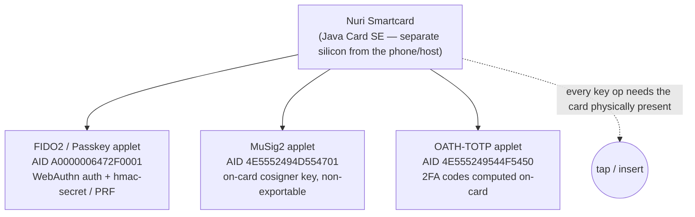
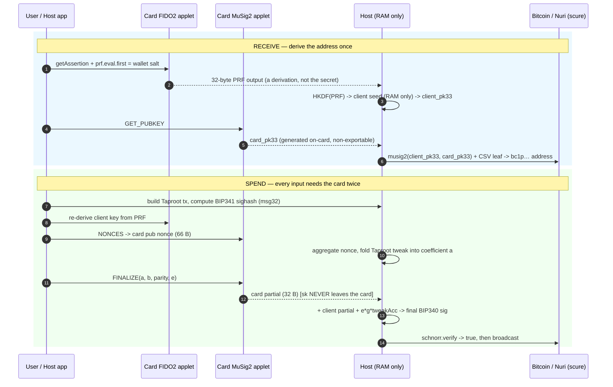
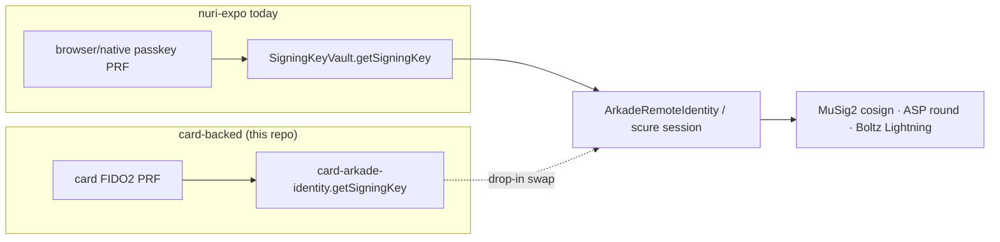

# Nuri Passkey PRF Smartcard

**A fingerprint smartcard that is your passkey and your Bitcoin wallet — same wallet as the Nuri app, with the keys living inside a secure element that has no command to read them out.**

MIT-licensed, open hardware-wallet research that is already proven on a real card: a physical Feitian fingerprint Java Card co-signed a live Bitcoin transaction, derives the *same* wallet the Nuri phone/PWA derives, and logs in over WebAuthn like any passkey.

---

## Table of contents

- [The vision](#the-vision)
- [What it is today](#what-it-is-today)
- [Proven on a real card](#proven-on-a-real-card)
- [How it works](#how-it-works)
- [Same wallet as the Nuri app (PWA / nuri-expo)](#same-wallet-as-the-nuri-app-pwa--nuri-expo)
- [Where it sits vs other hardware wallets](#where-it-sits-vs-other-hardware-wallets)
- [Roadmap to the vision](#roadmap-to-the-vision)
- [Quick start](#quick-start)
- [Capability reference](#capability-reference)
- [Hardware: which card to buy](#hardware-which-card-to-buy)
- [Flashing a real card](#flashing-a-real-card)
- [What we can and cannot claim](#what-we-can-and-cannot-claim)
- [Repo layout & references](#repo-layout--references)

---

## The vision

Today a self-custody Bitcoin user juggles a phone wallet, a seed phrase, and — if
they are careful — a separate hardware signer. Three things to lose, back up, and
trust.

**Nuri's bet: collapse all of that into one card you can put your finger on.**

The card is, at once:

- your **passkey** (FIDO2/WebAuthn — log into Nuri and any RP that speaks passkeys),
- your **Bitcoin signer** (a MuSig2 cosigner key generated on-card, non-exportable),
- and the **root of your wallet identity** (the same key the Nuri app derives, so
  the card and the app are literally the same wallet).

Unlock is a **fingerprint, not a PIN** — match-on-card biometrics on a Feitian
BioCARD-class secure element. No seed phrase to leak; recovery is a published,
deterministic time-locked Bitcoin script, not an opaque backup blob.

The direction this is heading — the part worth building toward:

> **A wallet where the card is enough.** Tap the card to a phone or a Bitcoin
> point-of-sale terminal and pay, the way a Boltcard taps for Lightning or a
> contactless debit card taps at a checkout — but backed by your own keys and a
> real on-chain/Arkade wallet, not a custodial balance. Eventually: leave the
> phone at home.

That last mile (NFC tap-to-pay, terminal/POS flows, a Bitcoin debit-card form
factor) is **not built yet** — see [Roadmap](#roadmap-to-the-vision). Everything
below it *is*.

This grew out of the same lineage as [Bitkey](https://bitkey.world),
[Keycard](https://keycard.tech), [Tangem](https://tangem.com),
[Satochip](https://satochip.io), [Tapsigner](https://tapsigner.com) and
[Boltcard](https://boltcard.org) — see [the comparison](#where-it-sits-vs-other-hardware-wallets)
for where it diverges.

---

## What it is today

One physical card, a secure element running **three independent applets**, each
behind its own AID, plus a full host-side toolkit that turns the card into a real
Bitcoin wallet.



| Track | What the card does | Status |
|---|---|---|
| **FIDO2 + WebAuthn PRF** | Acts as a passkey authenticator; CTAP2 `hmac-secret` gives WebAuthn `prf`. Patched so **every** passkey is PRF-capable. | ✅ Real-card proven (PC/SC + native NFC) |
| **Bitcoin MuSig2 cosigner** | Generates a secp256k1 cosigner key on-card, returns only the pubkey, signs MuSig2 partials. | ✅ Real-card proven (live signet tx) |
| **Card-as-wallet** | `musig2(client, card)` Taproot wallet with a client+CSV recovery leaf — looks like one key on-chain. | ✅ Real signet + mainnet addresses |
| **Arkade / Lightning identity** | Card PRF is the root of the Nuri/Arkade client key; supports the VTXO tree-round tweak. | ✅ Key + tweak proven; app wiring pending |
| **OATH-TOTP** | Stores a 2FA secret, computes HMAC-SHA1 on-card (e.g. Hetzner). Secret never read back. | ✅ Real-card, RFC 6238 verified |
| **FIDO2 SSH security key** | Use the card as an OpenSSH `sk-ecdsa` hardware key. | 🧪 Experimental (host bridge in `scripts/`) |
| **Fingerprint unlock (match-on-card)** | Replace PIN with a fingerprint. Feitian confirms the API; SDK is NDA-gated. | 🔒 Hardware path identified, not integrated |
| **NFC tap-to-pay / POS** | Tap card to terminal to pay. | 🗺️ Vision — not built |

Two design rules hold throughout:

1. **The private keys never leave the card.** There is no "export key" APDU
   anywhere. The cosigner key is generated on-card; the passkey secret only ever
   emits a one-way PRF derivation.
2. **The Bitcoin signer and the FIDO2 authenticator are separate applets.** A bug
   or reset in the passkey path cannot touch the Bitcoin key, and vice-versa.

---

## Proven on a real card

These are not simulations. A physical Feitian BioCARD sample, two custom applets
installed side by side, did the following:

- **Co-signed a live Bitcoin Signet transaction**, broadcast and confirmed in
  block `308802`:
  [`d9ecca378bd015f2bd39d3113d3dadc65e6b6f29b72c1d1e6a7d73f246994c38`](https://mempool.space/signet/tx/d9ecca378bd015f2bd39d3113d3dadc65e6b6f29b72c1d1e6a7d73f246994c38)
  — 1337 sats, `OP_RETURN "Nuri.com"`, change back to the card wallet. A second
  confirmed run landed in block `308804`
  (`c85a73fab75f8649852123d1fff336df2f098792554086a290433ce0999c3e81`).
- **Generated its MuSig2 cosigner key on-card** (`INS_KEYGEN`) and returned only
  `card_pubkey33`; the host suite verified `key_origin: on_card_keygen_non_exportable`,
  `card_partial_verified: true`, `final_signature_verified: true`.
- **Derived a stable Nuri Taproot wallet address** that is identical across
  re-runs (signet `tb1pywzzgk3p7a5zhhkpqn548pm0xpqqfvzl4jylev522glcjy5npc4sckt9fa`),
  and a real **mainnet** address via the same path.
- **Passed real WebAuthn PRF** over PC/SC and native NFC (`REAL_CARD_WEBAUTHN_PRF_OK`),
  returning two 32-byte `hmac-secret` outputs.
- **Derived the Nuri/Arkade client identity key** byte-for-byte identically to the
  phone (`CARD_ARKADE_IDENTITY_STABLE_OK`).

Full transcripts and explorer links: [`docs/real-card-signet-proof.md`](docs/real-card-signet-proof.md),
[`docs/nuri-card-wallet-proof-report.md`](docs/nuri-card-wallet-proof-report.md),
[`docs/logs/`](docs/logs).

Reproduce the host-side proofs (no card needed) and the real-card proofs (card
inserted) with the commands in [Capability reference](#capability-reference).

---

## How it works

The wallet is a **2-of-2 MuSig2 key that looks like one ordinary Taproot address
on-chain**, with a time-locked recovery leaf so a lost card never means lost coins.
Both halves involve the card; the host only ever handles public data and a one-way
PRF derivation.



Two things make this work cleanly:

- **The card never parses Bitcoin.** The host (`@scure/btc-signer`) builds the
  transaction, the session, and the Taproot tweak. The card only protects keys and
  returns a partial. Smallest possible audit surface.
- **The Taproot tweak is host-side**, exactly where BIP327 puts it (folded into the
  coefficient `a` and a final `e·g·tweakAcc` term). So the card runs plain MuSig2
  (`s = k + e·a·sk`) and its signature is **byte-compatible with `sign.nuri.com`** —
  no applet change needed to sign for the tweaked output key.

Full Mermaid walkthrough, the PRF→client-key step, and a phone-software-key /
phone-TEE / smartcard threat-model comparison:
[`docs/card-architecture.md`](docs/card-architecture.md).

---

## Same wallet as the Nuri app (PWA / nuri-expo)

This is the point that ties the card to the product. The Nuri app
([`nuri-expo`](https://github.com/nuri-com)) — native **and** its web PWA — derives
its wallet from a WebAuthn passkey's PRF output. The card derives its wallet from
**its own** passkey's PRF output. The derivation is identical, so:

> The same passkey credential resolves the same wallet whether it lives in iOS
> Keychain, in the browser at `nuri.com`, or **on the card**. The card is a
> drop-in for the phone passkey.

The app and the card agree on every constant:

| Constant | Value | App location | Card location |
|---|---|---|---|
| PRF salt | `nuri-prf-salt-v1` | `config/constants.ts` | `scripts/card-arkade-*.mjs`, `card-prf-backup.sh` |
| WebAuthn rpId | `nuri.com` | `config/constants.ts` | PRF profile RP ID |
| HKDF salt / info | `app:nuri.com\|wallet\|v1` / `…\|chain=bitcoin\|fmt=taproot` | `lib/walletDerivation.ts` | `nuri-card-wallet.mjs` |
| HD path | `m/86'/0'/0'/0/0` (BIP86) | `lib/bitcoin/bip86.ts` | same |
| Wallet policy | `musig2(client, server)` key-path + client CSV leaf | `lib/bitcoin/…CSV.ts` | `scripts/card-cosign-tweaked.py` |
| CSV recovery | `52500` blocks | `config/constants.ts` | same |
| Signer lib | `@scure/btc-signer` `2.0.1` | — | same |

**The integration seam is one function.** In nuri-expo, every Bitcoin/Arkade
signature flows through `SigningKeyVault.getSigningKey()`
(`services/arkade/internal/signingKeyVault.ts`). It returns a 32-byte client
private key from the browser/native passkey PRF. A **card-backed vault** swaps that
one source — the card derives the same key (or, in the stronger model, the card's
MuSig2 applet *replaces the server* as the cosigner) — and everything downstream
(`ArkadeRemoteIdentity`, PSBT construction, MuSig2 aggregation) is unchanged.



Two product shapes, both honest about trade-offs, are mapped in
[`docs/nuri-arkade-card-cosigner-plan.md`](docs/nuri-arkade-card-cosigner-plan.md):

- **Card as PRF root, server stays cosigner** — smallest change. The card gates the
  *client* key; `sign.nuri.com` remains the second MuSig2 party. Same wallet
  address as today. Lightning works unchanged through the existing Boltz path.
- **Card replaces the server cosigner** — a *new* `musig2(client, card)` wallet that
  works with **no server at all** (this repo's standalone wallet). Server-independent,
  but a new address/policy. This is the "another layer if Nuri is gone" your friend
  asked about — already working end-to-end here.

Status and the exact wiring point: [`docs/arkade-lightning.md`](docs/arkade-lightning.md).

---

## Where it sits vs other hardware wallets

| | Form | Unlock | Signing model | Open | Same-as-app wallet | Tap-to-pay |
|---|---|---|---|---|---|---|
| **Nuri card** | NFC smartcard | **Fingerprint** (match-on-card) | **MuSig2 2-of-2**, looks like 1 key, CSV recovery | ✅ MIT host | ✅ **passkey PRF = phone wallet** | 🗺️ goal |
| Bitkey | fob + phone + server | phone biometric | 2-of-3 multisig | ✅ | app-paired | no |
| Keycard | NFC smartcard | PIN | single-key BIP32 | ✅ | no (separate keys) | no |
| Tangem | NFC card | card + phone | single-key (2/3 backup) | partial | no | no |
| Satochip | NFC/contact card | PIN | single-key; MuSig2 on a beta branch | ✅ (AGPL) | no | no |
| Tapsigner | NFC card | PIN/CVC | single-key | closed | no | no |
| Boltcard | NFC card | — | **not a signer** (LNURLW custodial tap) | ✅ | no | ✅ Lightning |

What is genuinely different here:

- **The card is also a passkey, and that passkey *is* the wallet.** Nobody else
  fuses WebAuthn login and Bitcoin key derivation into one credential. It means the
  card logs you into the app *and* signs your Bitcoin, and the app on any device
  derives the identical wallet.
- **Fingerprint instead of PIN**, on a card you tap — Bitkey-class biometrics in a
  card form factor.
- **MuSig2 key-path Taproot** — one key on-chain, full privacy, with a deterministic
  CSV recovery leaf instead of a seed-phrase backup. Boltcard gives you the tap but
  not the keys; Keycard/Tapsigner give you the keys but not the tap or the app-wallet
  identity. Nuri aims at both ends.

---

## Roadmap to the vision

Honest scope, eyes open. The friend-conversation question — *"can a hardware wallet
add a layer of security if the Nuri server is gone, and can the card eventually
replace the phone?"* — breaks into these tracks:

**1. Card as an independent signer (server-optional) — _done in this repo._**
The standalone `musig2(client, card)` wallet already signs real Bitcoin with no
server. Wiring it into nuri-expo behind a `card` cosigner flag is the next app-side
task (the `SigningKeyVault` swap above).

**2. Hardware-wallet co-signer (Trezor / Coldcard-style) — _Taproot leaf, not 3rd MuSig2 party._**
Production MuSig2 on mainstream hardware wallets is still thin (the two-round nonce
protocol is dangerous on constrained devices), and a phone+server+HW MuSig2 would be
3-of-3 — needed every tx, wrong UX. The feasible path is to add the HW wallet as an
**extra Taproot script leaf** (`client + hardware`) alongside the MuSig2 key-path and
the CSV recovery leaf. Server-independent, no CSV wait, and HW wallets support
Taproot script-path multisig *today*. Keep any new leaf **deterministic from the HW
pubkey + published policy**, same trick as v4, so no opaque backup data returns.
FROST is the longer-term threshold option.

**3. Fingerprint UV in our own applet — _needs the NDA SDK._**
Feitian confirms a Java applet can call the match-on-card fingerprint API to gate a
private-key operation, but the BioCARD SDK is NDA-gated. Until then: FIDO2 PIN/UV, or
Feitian's preloaded biometric FIDO2 stack.

**4. Phone-optional tap-to-pay — _the headline, not built._**
Tap the card to a phone or a Bitcoin POS terminal to pay. Building blocks: the
contactless ISO-14443 interface (works), Lightning via Arkade+Boltz (wired), and a
Boltcard/LNURLW-style tap profile (to design). The end state — a Bitcoin debit-card
form factor where the card alone is the wallet — is the north star this repo is
clearing the path for.

---

## Quick start

Requirements: **Node 20+**, **Java 17** (FIDO2 simulator), **Python 3.10+**, **git**.
A physical card is only needed for the `card:*` / `cosign:real-card` / `nuri:wallet:*`
commands; everything else runs against simulators.

```bash
npm install
npm test            # MuSig2 simulator tests vs @scure/btc-signer
npm run musig2:demo # prints verified=true
npm run cosign:demo # prints NURI_CARD_COSIGN_FLOW_OK, final_signature_verified=true
```

Full host-side end-to-end (clones the FIDO2Applet baseline, builds the jCardSim,
runs the PRF mapping test):

```bash
npm run e2e
```

One console app fronts every function — install it once:

```bash
npm link
nuricard            # interactive menu
nuricard help       # list every subcommand
```

`nuricard` forwards to the npm scripts (nothing to keep in sync). The contact reader
index defaults to `GP_READER=2`; override in the environment if yours differs. Run
**one** PC/SC card command at a time — a second one can reset the card mid-APDU.

---

## Capability reference

> Convention: `cosign:*` / `card:*` / `nuri:wallet:*` / `bitcoin:card:*` talk to a
> real card over PC/SC. `*:sim`, `musig2:demo`, `cosign:demo`, `server:cosigner:*`
> are host-only simulations. Default Bitcoin network is **signet** (free); switch to
> `--network=mainnet` only when you mean real BTC.

### Bitcoin wallet (card as signer, no server)

A stable Nuri Taproot wallet: `musig2(client, card)` key-path + client CSV
(52500-block) recovery leaf. **No secret is stored on the host** — the client key is
re-derived from the card's FIDO2 PRF every operation; the card's MuSig2 applet is the
cosigner.

```bash
# one-time: enroll a wallet PRF credential on the card (stores only a credential id)
npm run card:prf:enroll -- --profile wallet-client --resident-key discouraged \
  --user-verification discouraged --registration-prf prf

npm run nuri:wallet:address                                            # provision + show address
npm run nuri:wallet:utxos                                              # check funding
npm run nuri:wallet:spend -- --network=signet --to=self --amount-sats=1337 --fee-sats=500
npm run nuri:wallet:spend -- --network=signet --to=self --amount-sats=1337 --fee-sats=500 --broadcast
```

The spend builds a real key-path Taproot tx, computes the BIP341 sighash, signs each
input with the physical card via the tweaked cosign, verifies BIP340 locally, then
optionally broadcasts. The lower-level `bitcoin:card:*` demo
(`address` / `utxos` / `spend` / `status`) does the same with explicit OP_RETURN and
unconfirmed-UTXO options.

### MuSig2 cosigner (real card + simulators)

```bash
npm run cosign:real-card:keygen   # on-card keygen -> REAL_CARD_COSIGN_FLOW_OK
npm run cosign:real-card          # sign with the existing non-exportable card key
npm run cosign:web:real-card      # browser-triggered real-card cosign demo (cosign-demo.html)
npm run cosign:web                # same UI, simulated on-card keygen
npm run server:cosigner:software  # models a server-attached card/HSM boundary
npm run server:cosigner:card-sim
npm run server:cosigner:apdu-sim  # APDU framing + nonce-replay rejection
npm run cli:e2e                   # all three backends; REAL_CARD=1 adds real PRF
```

The MuSig2 applet (`dist/nuri-musig2-v20-keygen.cap`, AID `4E5552494D554701`)
exposes only: individual pubkey, public-nonce generation, one-shot partial signing,
nonce burn. See [`docs/musig2-card-extension.md`](docs/musig2-card-extension.md).

### Arkade / Lightning identity

```bash
npm run card:arkade:key       # card PRF -> Arkade client key (stable, nuri derivation)
npm run card:arkade:identity  # importable identity seam (getPublicKey / getSigningKey)
```

Tree-round tweak (VTXO scriptRoot) via
`scripts/card-cosign-tweaked.py --script-root <hex32>`. Lightning rides the existing
Boltz submarine-swap path once the card backs the wallet identity — no card-specific
Lightning code. Details: [`docs/arkade-lightning.md`](docs/arkade-lightning.md).

### FIDO2 / passkey / WebAuthn PRF

```bash
npm run card:prf:info             # advertised: hmac-secret, rk, clientPin, CTAP2.0/2.1
npm run card:prf:enroll           # enroll a credential profile
npm run card:prf:derive           # derive the backup secret  (--raw for hex only)
npm run card:prf:selftest         # same salt -> same PRF, different salt -> different PRF
npm run card:test                 # real-card WebAuthn PRF  -> REAL_CARD_WEBAUTHN_PRF_OK
npm run card:test:pin             # same, with FIDO2 PIN/UV required
npm run card:pin:status|set|change|verify
```

The PRF mapping matches browsers exactly: the user salt becomes
`SHA-256("WebAuthn PRF\0" || salt)` and is sent through CTAP2 `hmac-secret`. Same
card credential + same salt → same 32 bytes, forever.

### Web & mobile PRF

```bash
npm run web:prf      # http://localhost:8765/prf-test.html  (register + authenticate)
npm run web:tunnel   # ngrok HTTPS for phone testing
npm run mobile:android  # native Expo NFC probe (ISO-DEP -> CTAP2 hmac-secret)
npm run mobile:ios      # CoreNFC build (needs Xcode 26+, signing)
```

The mobile probe talks **ISO-DEP NFC directly** (not browser WebAuthn) — the
cleanest phone-tap PRF path while mobile-browser NFC/WebAuthn routing is unreliable.
A PC/SC card in a reader is **not** automatically a browser roaming authenticator;
the web page works with whatever authenticator the browser can see.

### Smartcard as a remote MCP cosigner

```bash
npm run card:mcp           # serve http://127.0.0.1:8799/mcp  (+ /healthz)
npm run card:mcp:tunnel    # public URL for a remote agent
npm run card:mcp:selftest  # JSON-RPC path + one real card signature
```

Mirrors the Nuri MCP shape (`initialize` / `tools/list` / `tools/call`) but the
signer is the card on this machine — no browser, no `sign.nuri.com`. Tools:
`nuri_card_info`, `nuri_card_cosign`, `nuri_card_cosign_tweaked`,
`nuri_card_wallet_address|utxos|spend`.

### On-card OATH-TOTP

```bash
npm run card:totp:build && npm run card:totp:install   # AID 4E555249544F5450
nuricard totp put "HETZNER_BASE32"
nuricard totp                                          # current 6-digit code
```

The card has no clock, so the host sends the time counter; the secret is written in
and never read out. Verified against the RFC 6238 vector
(`python3 scripts/card-totp.py --selfcheck`).

### FIDO2 SSH security key (experimental)

`scripts/ssh-pcsc-sk-provider.c` / `ssh-pcsc-sk-helper.py` /
`dist/nuri-pcsc-sk-provider.so` let OpenSSH use the card as an `sk-ecdsa-sha2-nistp256`
hardware key over PC/SC. Untracked/experimental — a "fun extra," not a product track.

---

## Hardware: which card to buy

The chip name is not enough. The card must be **unfused/unlocked** and the seller
must provide the **GlobalPlatform/SCP transport keys** so you can install
`dist/FIDO2.cap`. Buy a few, run the same commands against each.

| Priority | Target | Why | Watch out |
|---|---|---|---|
| 1 | **J3R180 / JCOP4 / 180K** | Newer JCOP4, JC 3.0.5, memory headroom | seller must give keys; bulk/MOQ |
| 2 | **J3H145 / JCOP3 / 145K** | Listed as working by upstream FIDO2Applet | often pricier |
| 3 | **J3R150 / JCOP4 / 150K** | Cheap test card; "not fused / TK provided" is a good sign | not in upstream tested list |
| — | **Feitian FT-JCOS BioCARD** | The fingerprint target: JC 3.0.5, match-on-SE biometrics, preloaded FIDO2, room for a Bitcoin applet | fingerprint applet SDK is NDA-gated |

Required card capabilities (FIDO2/PRF): Java Card Classic 3.0.4+, GlobalPlatform
install/delete (SCP03 preferred), P-256 keygen, ECDSA-SHA256, ECDH plain, SHA-256,
AES-256-CBC no-pad, TRNG, ~100KB+ NVM. The MuSig2 applet additionally wants
secp256k1 — if the card doesn't expose it, keep MuSig2 host-side. Full
acceptance-test spec and the questions to send a manufacturer:
[`docs/hardware-manufacturer-spec.md`](docs/hardware-manufacturer-spec.md). Detailed
shopping notes and listings: [`docs/fido2-card-research.md`](docs/fido2-card-research.md).

Recommended first reader: an **ACS ACR39U** contact PC/SC reader for flashing and
CLI; optionally an **ACR122U** NFC reader for APDU/NFC experiments.

---

## Flashing a real card

Prebuilt CAPs ship in `dist/` (`FIDO2.cap`, `nuri-musig2-v20-keygen.cap`,
`nuri-oath-totp.cap`) with checksums in `dist/SHA256SUMS` and provenance in
[`dist/README.md`](dist/README.md). Rebuild with `npm run card:build`.

```bash
# install the FIDO2 applet with the key your seller supplied
GP_READER_INDEX=2 GP_KEY="your card key" npm run card:install
npm run card:test                                   # expect REAL_CARD_WEBAUTHN_PRF_OK

# install the MuSig2 applet next to it
npm run card:musig2:install
npm run cosign:real-card:keygen                     # expect REAL_CARD_COSIGN_FLOW_OK
```

Reset / reinstall on a **test** card only (destructive — wipes FIDO2 state):

```bash
FIDO2_RESET_CONFIRM=YES npm run card:reset
FIDO2_REINSTALL_CONFIRM=YES GP_READER_INDEX=2 npm run card:reinstall
```

Exact arguments depend on the card, SCP mode, and default keys. A real preloaded
Feitian sample needed a reset + GlobalPlatform delete/reinstall of the vendor FIDO2
applet before the local CAP took — the working recovery order and observed
reader/ATR/CTAP details are documented inline below the fold of card maintenance
notes and in [`docs/real-card-key-handling.md`](docs/real-card-key-handling.md). Never
publish a card's GlobalPlatform/SCP keys; keep them in a private vault.

**PIN / fingerprint:** don't ship a shared preset PIN. The intended production state
is *no* FIDO2 PIN — the first user sets their own via CTAP `clientPin setPin`, and
fingerprint UV replaces it once the Feitian biometric applet path is integrated.

---

## What we can and cannot claim

**We can claim:**

- A physical card co-signed, broadcast, and confirmed real Bitcoin transactions.
- The cosigner key was generated on-card and is non-exportable by API design.
- The card derives the *same* wallet/identity key the Nuri app derives.
- Real WebAuthn PRF works over desktop PC/SC and native phone NFC.
- The MuSig2 simulator matches `@scure/btc-signer` and rejects nonce reuse.

**We cannot claim (yet):**

- That mobile-**browser** NFC WebAuthn PRF works for this card — the native NFC app
  works; the OS/browser-routed path does not reliably pass PRF through.
- That fingerprint unlock is integrated into *our* applet — Feitian confirms the API
  exists, but the SDK is NDA-gated; today it's PIN/UV or Feitian's own FIDO2 bio stack.
- That the MuSig2 applet is audited or production-ready — it's a proven device
  *primitive*, not a reviewed product signer (nonce policy, PIN/fingerprint policy,
  and a final host flow against the exact nuri-expo `@scure/btc-signer` session still
  need hardening).
- Physical tamper resistance from a blank dev card — production needs an
  EAL-certified chip with documented keys.

Upstream license note: Satochip's `musig2-support` applet (the reference for real
Java Card MuSig2 nonce-reuse protection) is **AGPL-3.0**; this repo is **MIT**. Do not
copy Satochip Java into this repo without a deliberate license decision — keep it as
an upstream reference, or write a clean-room minimal signer.

---

## Repo layout & references

- `card/` — `NuriOathTotp.java` and the Java Card build (`ant`).
- `src/musig2/` — method-level and APDU-level MuSig2 simulators (`@scure`-compatible).
- `scripts/` — every real-card and host flow (wallet, cosign, PRF, Arkade, MCP, TOTP).
- `dist/` — prebuilt CAPs + checksums + provenance.
- `web/` — `prf-test.html`, `cosign-demo.html`, PWA manifest/service-worker.
- `mobile/expo-nfc-prf-probe/` — native Android/iOS ISO-DEP NFC PRF probe.
- `test/` — Node MuSig2 tests + Python FIDO2 PRF mapping test.
- `bin/nuricard` — the unified console app.
- `docs/` — architecture & security pitch (`card-architecture.md`), Arkade plan
  (`nuri-arkade-card-cosigner-plan.md`, `arkade-lightning.md`), real-card proofs,
  hardware spec, card research.

This repo does **not** vendor the FIDO2Applet source; `npm run fido2:prepare` clones
[Bryan Jacobs' FIDO2Applet](https://github.com/BryanJacobs/FIDO2Applet) at a pinned
ref into `vendor/FIDO2Applet-clean` (git-ignored) and builds the simulator.

Specs & libraries:
[WebAuthn L3 PRF](https://www.w3.org/TR/webauthn-3/) ·
[CTAP2.1 hmac-secret](https://fidoalliance.org/specs/fido-v2.1-ps-20210615/fido-client-to-authenticator-protocol-v2.1-ps-20210615.html) ·
[BIP327 MuSig2](https://bips.dev/327/) ·
[scure-btc-signer](https://github.com/paulmillr/scure-btc-signer#musig2) ·
[Yubico PRF guide](https://developers.yubico.com/WebAuthn/Concepts/PRF_Extension/Developers_Guide_to_PRF.html).
</content>
</invoke>
