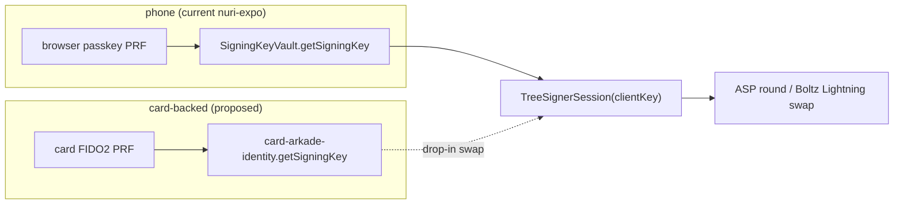

# Arkade / Lightning — card-backed identity (status & integration plan)

This documents how far the card-backed Arkade path is proven, and exactly where
the remaining nuri-expo wiring goes. Honest scope, no cargo-cult.

## Proven on the real card (this repo)

1. **Card → Arkade client key** — byte-for-byte the nuri-expo derivation:
   `card FIDO2 PRF → HKDF → BIP86 m/86'/0'/0'/0/0 → client private key`.
   - `scripts/card-arkade-identity.mjs` (`getPublicKey()` / `getSigningKey()`) →
     `CARD_ARKADE_IDENTITY_STABLE_OK`, stable across taps.
   - `scripts/card-arkade-key.mjs --verify-twice` → same proof, CLI form.
   - Same `PRF_SALT` ("nuri-prf-salt-v1"), same HKDF salt/info as
     `nuri-expo/lib/walletDerivation.ts`, same BIP86 path as
     `nuri-expo/lib/bitcoin/bip86.ts`.

2. **Card → Arkade tree-round tweak signature** — `scripts/card-cosign-tweaked.py`
   gained `--script-root <hex32>`. Arkade tree rounds tweak by the **VTXO
   scriptRoot** (not the fixed CSV leaf our standalone wallet uses). Proven:
   `tweak_mode: arkade-script-root-tree-round`, signature verifies against the
   script-root-tweaked output key.

So the card can already (a) be the wallet identity root and (b) produce a valid
client partial for an Arkade tree round using the scriptRoot tweak.

## What the card is, in the Arkade model

| | On-chain card wallet (works) | Arkade wallet |
|---|---|---|
| Client key | card FIDO2 PRF | card FIDO2 PRF (same) |
| Cosigner | **card MuSig2 applet** | **the Arkade ASP** (`arkade.computer`) |
| Tweak | fixed CSV leaf | VTXO **scriptRoot** per round |
| Card applet used | FIDO2 + MuSig2 | **FIDO2 only** (ASP is the other signer) |

**Important:** the card's MuSig2 applet is NOT a party in Arkade. Arkade's
forfeit/boarding rounds are 2-of-2 between the **user's client key** and the
**ASP**. The card's value here is being the **PRF root**: without the physical
card, no client key can be derived, so no arkade round can be signed. This is
the same trust model the phone uses (browser passkey PRF → software client key
→ TreeSignerSession), but card-gated.

## What remains (nuri-expo wiring — not in this repo)

The card can derive the key; the SDK consumes it. The seam in nuri-expo is
`services/arkade/internal/signingKeyVault.ts` → `SigningKeyVault.getSigningKey`,
which currently prompts the browser passkey PRF. A card-backed vault swaps that
one source for `card-arkade-identity.mjs`'s `getSigningKey()`.

### Concrete swap point

`SigningKeyVault` calls `useExistingWalletPasskeyWithAssertion(...)` then
`deriveBitcoinPasskeySigningKey(prf)`. To go card-backed:

1. Add a transport: run `scripts/card-arkade-identity.mjs` (or a small native
   bridge) and call `getSigningKey()` instead of the passkey assertion.
2. Keep everything downstream identical: the same BIP86 client key feeds
   `TreeSignerSession` and the Arkade wallet.

### Why this can't be a standalone script (honest)

- `TreeSignerSession` is an **internal** SDK export (`@arkade-os/sdk/dist/.../tree/signingSession`),
  not in the public `exports` map. The public path is the `Wallet`/identity
  bootstrap, which needs a **live ASP** (`arkade.computer`) + nuri-expo's
  auth/credId bootstrap. Faking an in-process round would not be a real Arkade
  round and would mislead.
- Lightning runs through **Boltz** (`api.boltz.exchange`) on top of the funded
  Arkade wallet — a live network path, not a unit test.

So the next session's work is in `nuri-expo`, not here: point `SigningKeyVault`
at the card identity module, run the app against `arkade.computer`, and do a real
boarding + Boltz swap with the card in the reader.

## Lightning

Arkade Lightning = Boltz submarine swap on top of the Arkade VTXO wallet. It is
already wired in nuri-expo (`@arkade-os/boltz-swap`, `ArkadeLightningSendService`).
Once the card backs the wallet identity, Lightning works through the existing
Boltz path — no card-specific Lightning code needed. The card gates the client
key; the swap uses the wallet as-is.
