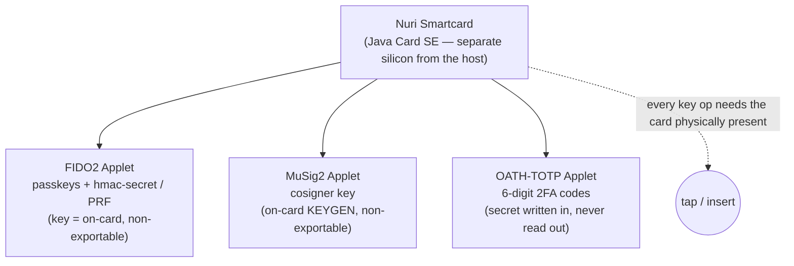
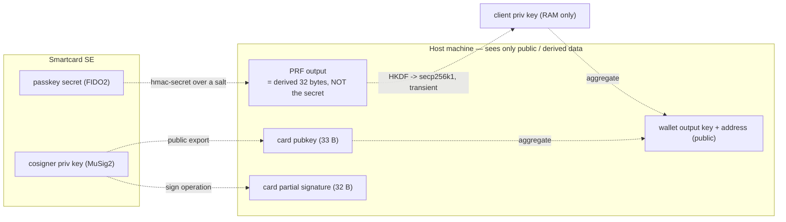
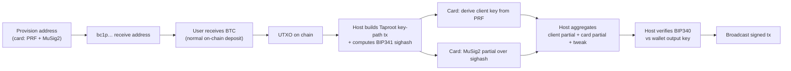
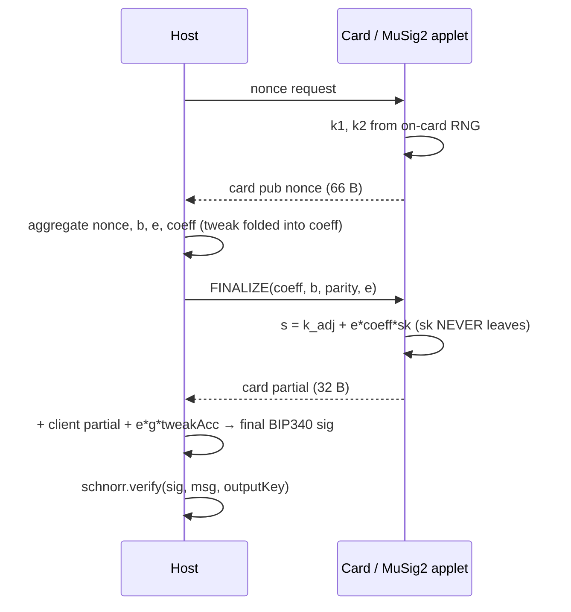
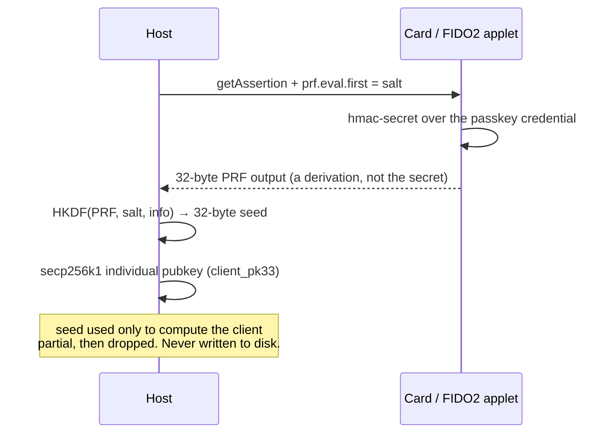
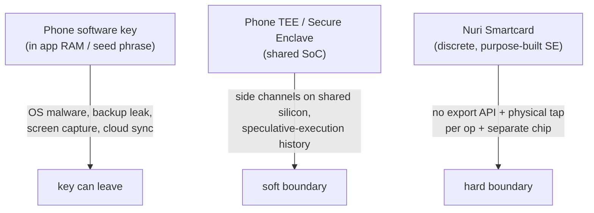

# Nuri Smartcard — Architecture & Security Pitch

One card. Three applets. Keys that **cannot leave**. A Bitcoin Taproot wallet
that is 2-of-2 by construction but looks like a single key on-chain.

This doc explains what the card does (FIDO2/PRF, MuSig2, OATH-TOTP), how a
spend works end-to-end, and why a dedicated smartcard SE is a stronger trust
root than a software key or a phone TEE.

---

## The complete 2-of-2 round on one page

Everything below is proven on the real card (`scripts/card-full-round-proof.sh` →
`CARD_FULL_ROUND_PROOF_OK`). The client key is re-derived from the card's FIDO2
PRF every operation; the cosigner partial comes from the card's MuSig2 applet;
the host only aggregates and applies the public Taproot tweak.

```mermaid
sequenceDiagram
  autonumber
  participant U as User / Host app
  participant C as Card FIDO2 applet
  participant M as Card MuSig2 applet
  participant H as Host (RAM only)
  participant BC as Bitcoin / Nuri (scure)

  rect rgb(235,248,255)
    Note over U,BC: RECEIVE — derive the wallet address (once)
    U->>C: getAssertion + prf.eval.first = wallet salt
    C->>C: hmac-secret over the passkey credential
    C-->>H: 32-byte PRF output (a derivation, not the secret)
    H->>H: HKDF(PRF) -> 32-byte client seed (RAM, never written to disk)
    H->>H: client_pk33 = secp256k1 pub(seed)
    U->>M: GET_PUBKEY
    M-->>H: card_pk33 (cosigner key generated on-card, non-exportable)
    H->>BC: musig2(client_pk33, card_pk33) + CSV leaf -> Taproot output key
    BC-->>U: bc1p… receive address (same on every re-derivation)
  end

  rect rgb(240,255,240)
    Note over U,BC: SPEND — every input needs the card (twice: PRF + MuSig2)
    U->>H: build Taproot key-path tx, compute BIP341 sighash (msg32)
    U->>C: getAssertion + prf.eval.first = wallet salt  (RE-derive client key)
    C-->>H: PRF output -> client seed (RAM)
    U->>M: NONCES
    M->>M: k1,k2 from on-card RNG
    M-->>H: card pub nonce (66 B)
    H->>H: aggregate nonce, b, e; fold Taproot tweak into coefficient `a`
    U->>M: FINALIZE(a, b, parity, e)
    M->>M: s = k_adj + e*a*sk  (sk NEVER leaves the card)
    M-->>H: card partial (32 B)
    H->>H: client partial (software, same g*gAcc fold) + e*g*tweakAcc
    H->>H: final BIP340 signature
    H->>BC: schnorr.verify(sig, msg32, wallet output key)
    BC-->>H: true
    H->>BC: broadcast signed tx
  end
```

Key property: the host sees a PRF derivation, public keys, public nonces, and
partials. It never sees a card private key. Remove the card and steps 4, 9-15
become impossible — no client key, no partial.

---

## What is on the card

The physical card is a Java Card secure element (JCOP-class). It runs isolated
applets. Nothing on the card is readable back — there is no "export private key"
command anywhere.



- **FIDO2 applet** — stores passkey credentials and implements CTAP2
  `hmac-secret`. Patched in this repo to advertise `hmac-secret` by default, so
  **every** passkey is PRF-capable.
- **MuSig2 applet** — generated its cosigner key on-card (`INS_KEYGEN`) once and
  returns only the public key. Signs partials; the private key never appears in
  any APDU.
- **OATH-TOTP applet** — stores a TOTP secret and computes HMAC-SHA1 on-card for
  2FA (e.g. Hetzner). The host only ever sees the 6-digit code, never the seed.

---

## Two keys, both on the card, neither stored anywhere else

The wallet is `musig2(client, card)` — a 2-of-2 aggregate that looks like one
Taproot key on-chain. Crucially, **both** halves live on the card, but through
different mechanisms, and neither is persisted on the host:



- **Client key** is *re-derived every operation* from the card's own FIDO2 PRF
  via HKDF → secp256k1. It lives in host RAM for the signing and is dropped. The
  host stores **no secret** — only the PRF profile name + salt that selects
  *which* passkey credential to query.
- **Cosigner key** was generated on-card and is **non-exportable by API design**.

What actually crosses the USB/contactless boundary: a derived 32-byte PRF value,
public keys, public nonces, and partial signatures. None of those compromise any
card secret.

---

## How a receive → spend works



Every spend touches the card twice (once for the PRF, once for the MuSig2
partial). If the card is in your pocket, no signature can be produced — that is
the property, not a bug.

---

## The MuSig2 cosign step (card side)

The card's applet does plain MuSig2: `s = k + e·a·sk`. The Taproot tweak stays
host-side (that is where BIP327 puts it), folded into the coefficient `a` the
host already sends. So the card signs for the full tweaked Taproot output key
**without any applet change**, and the final signature is byte-compatible with
`sign.nuri.com`.



Verified live: the card's signature verifies as a BIP340 key-path signature for
the exact Taproot address that `@scure/btc-signer` derives from the same keys.

---

## The PRF → client key step



Same salt + same passkey credential → same client key, every time. Different
salt → different client key. The passkey secret itself is never exposed; only a
one-way derivation of it leaves the card.

---

## Why a dedicated smartcard beats a phone software key or a phone TEE



| Property | Phone software key | Phone TEE / SE | **Nuri Smartcard** |
|---|---|---|---|
| Private key extractable by host malware | **yes** (if in RAM) | hard | **impossible** (no API) |
| Remote-triggered signing (no user present) | **yes** | depends | **no — card must be physically tapped** |
| Shares silicon/attack-surface with phone OS | **yes** | partially | **no** (discrete chip) |
| Seed-phrase backup leak risk | **high** | medium | **none** (no seed; CSV recovery instead) |
| Single compromise = total loss | often | less | **no** (2-of-2 MuSig2) |
| User-reasonable independently of any phone/OS | no | no | **yes** |

The two properties a phone fundamentally cannot give you:

1. **Non-exportability by construction.** There is literally no command to read
   the key back out. It was generated on-card and only signs through a controlled
   APDU. A phone key, even in a TEE, is only "hard to get" — the card is "no API
   exists."
2. **Physical-possession consent per operation.** Every signature needs the card
   in the reader. A laptop compromised by malware cannot sign anything while the
   card is in your pocket. A phone wallet, by contrast, can be triggered by
   anything the phone can do.

### The honest caveats (don't oversell to a technical friend)

- **Certification matters.** A blank/test JavaCard gives the same *API* but not
  the same *physical* tamper resistance. Production needs an EAL-certified chip
  (JCOP P71 / J3R-class with documented keys). The dev card here proves the
  protocol, not the physical security claim.
- **One card holds both keys.** In this repo the client key (via PRF) and the
  cosigner key (MuSig2) live on the *same* card. That is great UX and still far
  stronger than a phone key, but true two-factor independence wants the passkey
  on the computer and the card as a separate cosigner. The card-only mode is the
  "everything on one card" convenience tier.
- **PIN/UV should be on.** Currently the FIDO2 applet runs with PIN off for
  friction-free demos. For real security, possessing the card alone must **not**
  be enough — enable PIN/UV so a stolen card cannot be used. Recovery is handled
  by the 52500-block CSV leaf, so a lost card does not lock funds forever.

---

## The one-line pitch

> Your Bitcoin keys are generated and live inside a dedicated secure element.
> There is no command to read them out, and every signature needs the card
> physically present. The wallet is a 2-of-2 MuSig2 key that looks like one
> normal Taproot address on-chain, with a time-locked recovery path so a lost
> card never means lost coins. No seed phrase to leak, no phone TEE boundary to
> argue about, no software key in RAM.
```
