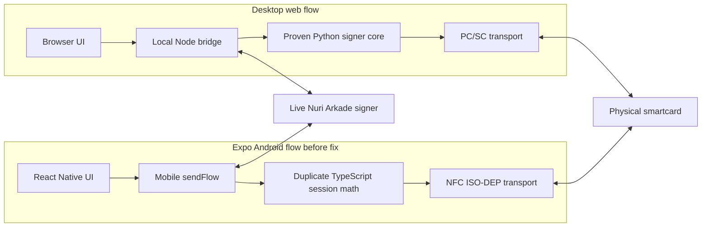
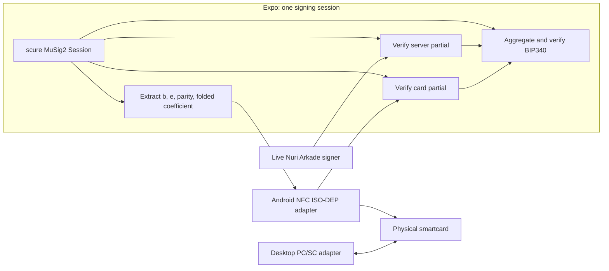

# Expo versus desktop card flow: incident report and permanent fix

Date: 2026-07-10

Branch: `challenge/nfc-tap-to-pay`

Scope: physical Nuri smartcard, Android Expo app, desktop browser/local bridge,
live Nuri Arkade signer, Ark mainnet, and Boltz Lightning send flow.

## 2026-07-11 profile follow-up

The deployed `/api/arkade/receive/sync` response was probed for the exact current
credential/card owner. It returned HTTP 200 and the `lightning`, `boarding`, and
`receives` arrays, but no `account` property. Expo incorrectly treated
`synced.account.username` as the username source and produced:

```text
receive sync returned no registered Lightning username for this card credential
```

The desktop page appeared correct because its local bridge did extra work:

```text
/arkade/info (existing registration)
  -> /arkade/auth (challenge)
  -> physical-card FIDO assertion
  -> /arkade/lnurl/status (smartcard@nuri.com)
  -> /api/arkade/receive/sync (receive rows)
```

Expo now runs the same two-source contract. Authenticated LNURL status is the
only username/address source; receive sync is the receive-row source. Both
operations use the exact configured credential and physical MuSig2 key. A
future sync `account` field is accepted only as redundant data and must exactly
match the authenticated account.

The live auth response also returns `origin` as a comma-separated allowlist,
not one literal origin. Expo verifies that the credential profile origin is a
member of that list, while still using the exact profile origin in WebAuthn
client data. Profile authentication now asks for the four-digit card PIN and
switches between the MuSig2 and FIDO applets inside one NFC session.

## Executive summary

The physical card and its FIDO credential did not spontaneously become invalid.
The Android app failed because it was not actually running the same host-side
protocol as the working desktop flow.

The desktop browser delegates card operations to a local Node/Python bridge. The
Python implementation was already proven against the physical card. The Expo app
used NFC correctly, but independently reimplemented CTAP PIN authorization,
Nuri's send HTTP contract, and part of the MuSig2 session math in TypeScript.
Those duplicate implementations had drifted.

There were six failure groups:

1. The profile and terminal displayed hardcoded identity and merchant data.
2. Expo was started with a stale or incomplete credential profile.
3. The Android CTAP request combined PIN authorization with an unsupported
   `uv: true` option and returned CTAP status `0x2c`.
4. The mobile `/send/cosign` request used an obsolete nested payload, so the
   live server could not see the required top-level `challenge_token`.
5. The mobile MuSig2 implementation derived a different signing transcript from
   the server. It first ignored aggregate-key parity, then used custom
   elliptic-curve arithmetic whose negative modulo behavior differed between
   JavaScript and Python.
6. Both send runners subscribed to the funded event after broadcast and treated
   monitor or completion errors as success.

The permanent Expo-side signing fix was to delete the second mobile-only session
calculation and use one `@scure/btc-signer` MuSig2 `Session` for all of these
operations:

- verify the Nuri server partial;
- obtain `b`, `e`, aggregate nonce parity, and the folded card coefficient;
- send those exact values to the card's `FINALIZE` APDU;
- verify the card partial;
- aggregate both partials; and
- verify the final BIP340 signature.

The corrected Android run produced two valid card/server MuSig2 rounds and a
real Ark transaction:

```text
card partial verify: true
server partial verify: true
final aggregate verify: true

card partial verify: true
server partial verify: true
final aggregate verify: true

funding txid: 965a299bcf8b788eb0ef23896323c4ed97133836e84df19fffcbbcd63a33cc1a
```

The live Ark indexer returns the transaction PSBT:

<https://arkade.computer/v1/indexer/virtualTx/965a299bcf8b788eb0ef23896323c4ed97133836e84df19fffcbbcd63a33cc1a>

That proves NFC card signing, Nuri cosigning, final aggregation, SDK transaction
construction, and Ark broadcast. It does not by itself prove that the Lightning
invoice settled.

## Terminology

The failing phone build is an Expo/React Native development app, not a browser
PWA. During debugging it was often called "the PWA" because it is the mobile
counterpart of the web UI. This document calls it the **Expo app** so the two
runtimes remain unambiguous.

## Architecture before the fix



Both paths talked to the same card and live server. Only the transport needed to
be platform-specific. Instead, the Expo path also duplicated protocol and
cryptographic session logic. That was the central design mistake.

## The identities that were being confused

Four identifiers appear in this system. They are related, but they are not the
same thing.

| Identifier | Owned by | Purpose | Can it change independently? |
|---|---|---|---|
| FIDO credential ID | FIDO2 applet and relying party | WebAuthn authentication and PIN-authorized assertions | Yes |
| Card MuSig2 public key | MuSig2 applet | Client signer for Arkade spends | Yes |
| Aggregate Ark wallet key/address | Card key plus Nuri server key | Owns Ark VTXOs | Changes if either signer key changes |
| Lightning username | Nuri server database | Human-readable receive mapping | Bound to a credential and card client key |

The current physical test card reported:

```text
MuSig2 applet version: 1.10
card client key:
02b9f7051445e003e60809f888ccca2057dba6609e5c5541eee64acef41ddbf034

live Nuri server key:
03e092559dccc545e0eb53c1a6add212495fb89b93b22cc5384d8ff82a0a117361

authenticated Lightning account:
smartcard@nuri.com
```

Older UI and documentation contained a different card key beginning
`022589ad...` and the hardcoded username `card@nuri.com`. Git history showed
that those values had been written into the UI rather than read from the card
and authenticated account endpoint.

That created the apparent contradiction:

- the UI claimed this was `card@nuri.com`;
- the inserted card returned another MuSig2 key;
- the server said a credential was already linked to a different client key;
- the displayed wallet address and balance did not match the expected account.

The server error was meaningful. It said the submitted **credential/client-key
pair** did not match the pair already stored by the server. It did not mean the
username had disappeared, and it did not prove that the inserted card still had
the old MuSig2 key.

The repository alone cannot prove whether the older `022589ad...` key was on a
different physical card or was replaced by a past applet key-generation event.
What is proven is narrower and sufficient:

- the current physical card reports `02b9f705...`;
- the old UI value was hardcoded;
- the current authenticated mapping returns `smartcard@nuri.com` for the
  current card/credential pair; and
- the profile must display only those live returned values.

## Failure timeline

### 1. "Read card account" appeared to do nothing

The UI swallowed or replaced missing data and did not expose the underlying
request state. The profile could render a plausible account even when it had not
received a live username, balance, or correct card mapping.

Fix:

- show loading and errors explicitly;
- validate every server response;
- reject malformed balances and missing public keys;
- remove the account-name, Lightning-address, and zero-balance substitutions.

### 2. The profile showed zero sats and no incoming payments

The page mixed data derived from the inserted card with hardcoded profile
identity. It also converted missing balance/list fields into `0` or empty arrays.
That made "request failed" indistinguishable from "real live balance is zero."

Fix:

- derive the aggregate wallet from the physical card key and live server key;
- obtain the Lightning username through an authenticated
  `/arkade/lnurl/status` request;
- require actual receive arrays and numeric balances;
- surface missing data as an error.

### 3. Registration returned HTTP 400

Observed error:

```text
credential already linked to a different client key
```

The registration helper previously supplied a hardcoded card key and default
credential profile. That allowed a real card, a stale profile, and an unrelated
key constant to be combined in one request.

Fix:

- require the exact profile name, profile path, and Arkade URL;
- read the MuSig2 public key directly from the inserted card;
- read credential ID, public key, RP ID, and origin from the selected profile;
- submit that exact pair to the live server;
- never create or select another credential implicitly.

The helper now fails before registration if any identity component is missing.

#### Why a credential was created without approval

Git history contained a helper named `ensureCardReceiveProfile()`. Normal live
flows called it before they needed the receive owner. If the configured profile
was absent or did not match its compiled RP/origin values, it called the card
enrollment command. If a profile file already existed, it passed `--force`.

That was a real state-changing operation hidden inside an "ensure" function. It
could create another FIDO credential and replace the selected local profile file
without an explicit registration action. That was wrong.

The fix deletes the entire ensure/enroll path from the live server. A read,
refresh, sync, invoice, claim, or payment now only reads the exact configured
profile and existing server binding. The only code allowed to submit a new
binding is the explicit **Register owner** route or the explicit username CLI.

#### Was the old credential or card key lost?

The repair did not install an applet, call MuSig2 `KEYGEN`, or change either card
key. It only changed host, Expo, and web code. The physical card still reports
applet version `1.10` and client key `02b9f705...`.

Creating another FIDO credential also does not change the separate MuSig2 key.
It can, however, overwrite the local JSON pointer to an older credential ID. An
older non-resident credential remains usable if its credential ID/profile was
preserved; the server row is not deleted by local enrollment. If no copy of the
old credential ID exists, the repository alone cannot reconstruct it.

In this incident the `credential already linked to a different client key` 400
shows that the server refused to overwrite an existing credential/card binding.
Later authenticated status returned `smartcard@nuri.com` for the current exact
profile and card. Therefore that current credential/account was not lost. The
older hardcoded `card@nuri.com` label was never reliable evidence of a second
live username or credential, so its recoverability cannot be inferred from that
label.

### 4. Expo crashed on `trim` of `undefined`

> **Superseded UI note (2026-07-11):** the incident fix below records the
> temporary diagnostic form used on 10 July. The current terminal intentionally
> pre-fills `smartcard@nuri.com`, exposes only that editable Lightning address
> plus a keypad-driven sats amount, and supplies merchant/memo internally. See
> `mobile/expo-nfc-prf-probe/README.md` for the current contract.

The terminal assumed a compiled-in merchant Lightning target. Once hardcoded
values were removed, an unset Expo environment value reached `.trim()`.

Fix:

- require runtime ASP, node, RP, credential ID, and credential public key;
- temporarily expose merchant name, Lightning address, memo, and amount as
  diagnostic inputs (superseded by the 11 July terminal contract above);
- validate Lightning targets before resolving LNURL;
- do not invent a merchant or recipient.

### 5. Expo returned "owner not found"

The running Metro server had loaded an old credential profile. The browser/local
bridge and the phone were therefore not authenticating the same account.

Fix:

- `NURI_PRF_PROFILE` is mandatory;
- the launcher exports the exact credential ID and SPKI public key from that
  profile;
- the Expo app requires those values at startup;
- the profile reads the existing credential/card binding from `/arkade/info`;
- only the explicit registration action may call the registration endpoint.

### 6. CTAP returned status `0x2c`

PIN-token acquisition succeeded, but the final `authenticatorGetAssertion`
request included both:

- a valid PIN protocol v1 `pinUvAuthParam`; and
- `options.uv = true`.

The card rejected that option combination with CTAP
`CTAP2_ERR_INVALID_OPTION (0x2c)`.

Fix:

1. call `authenticatorClientPIN/getKeyAgreement`;
2. establish the protocol-v1 shared secret;
3. request the PIN token with subcommand 5;
4. compute `pinUvAuthParam = left16(HMAC-SHA256(token, clientDataHash))`;
5. send `pinUvAuthParam` and `pinUvAuthProtocol = 1`; and
6. do not also request the unsupported `uv` option.

### 7. Nuri returned "challenge_token required"

The Expo app sent an obsolete nested object:

```text
context.challenge_token
context.send_package
context.assertion
```

The live `/api/arkade/send/cosign` contract expects:

```text
challenge_token                 top level
send package fields             top level
cosign_requests[]               top level
assertion_cred_id_b64u          top level on first cosign
client_data_b64u                top level on first cosign
auth_data_b64u                  top level on first cosign
sig_b64u                        top level on first cosign
```

Fix: make the Expo request byte-for-byte structurally equivalent to the working
desktop request.

### 8. "card partial signature verification failed"

The first mobile implementation contained:

```text
fold = 1
```

That ignored the aggregate key's x-only parity. BIP327 requires each signer
coefficient to include the aggregate parity factor (and accumulated tweak
parity when a tweak is present).

After correcting the fold, the card partial passed the exact equation used by
the Python proof but still failed `@scure/btc-signer` verification. That was the
clue that the app and server were not signing the same transcript.

### 9. "final aggregate signature verification failed"

The mobile-only `sessionMath.ts` implemented secp256k1 point addition with
JavaScript `%` expressions such as:

```text
(lambda * lambda - x1 - x2) % p
```

Python modulo returns a non-negative field element. JavaScript remainder keeps
the sign of the dividend. Negative intermediate coordinates therefore remained
negative instead of being normalized into `[0, p)`.

Consequences:

- the phone derived a different aggregate nonce representation;
- it derived different `b` and `e` session scalars;
- the card correctly signed the values it was given;
- the Nuri server correctly signed its own BIP327 session;
- each partial could appear internally valid in its own implementation; but
- the combined BIP340 signature was invalid.

Permanent fix:

- delete `mobile/expo-nfc-prf-probe/src/sessionMath.ts`;
- delete the unused duplicate `CardBackedAggregateIdentity` implementation in
  `mobile/expo-nfc-prf-probe/src/cardIdentity.ts`;
- create one `@scure/btc-signer` `Session`;
- use that same session for both partial verifications, card APDU inputs, final
  aggregation, and final Schnorr verification;
- fail closed if the pinned session fields are unavailable; and
- pin `@scure/btc-signer` to the tested version `2.2.0`.

## Post-broadcast monitoring race

After signing was fixed, the app logged a real funding txid and then waited
indefinitely. `waitForSwapFunded()` was started only **after** `wallet.send()`.
Expo could establish the WebSocket after the one `transaction.mempool` update
had already occurred and then wait forever.

The flow was also described as "optimistic" while silently catching monitor and
`send/complete` errors. That could display success without proving the final
server step.

Fix:

1. create the Boltz swap;
2. start `waitForSwapFunded()` before broadcasting;
3. build, authorize, sign, and broadcast the Ark transaction;
4. call `send/complete` immediately with the verified intent and returned txid;
5. require the funded monitor result; and
6. surface any error instead of returning a fabricated success object.

This ordering fix was loaded after the transaction above had already been
broadcast. It requires the next user-initiated real payment for end-to-end proof.

## Why the phone does not literally execute the Python file

PC/SC and Android NFC are different runtime APIs, and the Expo JavaScript bundle
cannot execute the desktop Python/pyscard process. That explains why a transport
adapter is required; it does not justify rewriting curve arithmetic.

This patch makes the Expo flow internally single-source: the existing pinned
`@scure/btc-signer` session is the only mobile MuSig2 session implementation.
The desktop bridge still uses the proven Python implementation. The two are
independent implementations of BIP327 and therefore must continue to share test
vectors and live transcript checks. A future repository-wide consolidation
could move desktop PC/SC APDU transport under the same JavaScript core, but that
larger migration is not required to remove the Expo regression.

## Architecture after the fix



The desktop and mobile transports remain different because the operating
systems expose different card APIs. Inside Expo, the signing transcript is no
longer independently recalculated beside the library session that verifies the
server.

## Files changed

| Area | Files | Result |
|---|---|---|
| Expo configuration | `App.tsx`, `run-expo-nfc-prf-probe.sh` | Exact profile and live endpoints required |
| Expo terminal/profile | `TerminalScreen.tsx`, `ProfileScreen.tsx`, `lnurl.ts` | Current DS-only terminal/profile contract is documented in the mobile README |
| CTAP PIN authorization | `ctapPrf.ts` | Protocol-v1 PIN UV token and correct assertion request |
| MuSig2 | `musig2Card.ts`, deleted `sessionMath.ts` and `cardIdentity.ts` | One active Expo identity/session core, fail-closed verification |
| Nuri send | `sendFlow.ts`, `card-arkade-claim.mjs` | Current payload contract, pre-broadcast monitoring, mandatory completion in both transports |
| Desktop bridge | `local-card-cosign-server.mjs` | Authenticated username lookup and strict live results |
| Registration | `card-nuri-lnurl-register.mjs`, `read-musig2-card-key.py` | Card key read physically; exact profile required |
| Web UI | `nuri-profile.html`, `merchant-terminal.html`, `nuri-checkout.html` | Live identity only; real payment errors are visible |

## How to run the Android flow

Use the exact credential profile intended for the inserted card. Do not rely on
the name of a default profile.

```bash
export NURI_PRF_PROFILE=/absolute/path/to/the-card-profile.json
export EXPO_PUBLIC_ASP_BASE=https://your-live-arkade-v4.example/v4
export EXPO_PUBLIC_NODE_URL=https://your-live-ark-node.example

npm run mobile:start -- --host lan
```

Open the installed Android development client. Confirm or edit the prefilled
Lightning address, enter the amount in sats with the embedded keypad, and press
`Charge`.

Then tap the card and enter its PIN. A valid send must log, for every input:

```text
card partial verify: true
server partial verify: true
final aggregate verify: true
```

It must then log:

```text
funding txid: <real txid>
send/complete: <live server response>
swap funded
```

Absence of any of those lines is not success.

## How to run the desktop comparison

The desktop browser is a UI over the local real-card bridge. Supply the same
exact profile and live endpoints used by Expo, then start the bridge:

```bash
export NURI_CARD_RECEIVE_PROFILE=<exact-profile-name>
export NURI_CARD_RECEIVE_PROFILE_PATH=/absolute/path/to/the-card-profile.json
export NURI_ARKADE_SIGNER_URL=https://your-live-arkade-v4.example/v4
export EXPO_PUBLIC_NODE_URL=https://your-live-ark-node.example
export FIDO2_BACKUP_PIN=<card-pin>

npm run cosign:web:real-card
```

Open:

- <http://127.0.0.1:8787/profile>
- <http://127.0.0.1:8787/terminal>

The profile must display the username and Lightning address returned by the
authenticated account request. It must never substitute an older username,
address, balance, or card key.

## Verification checklist

### Identity and profile

- [ ] Card public key is read from `GET_PUBKEY`.
- [ ] Credential ID and SPKI public key come from the selected profile.
- [ ] `/arkade/info` reports that exact credential/card pair as registered.
- [ ] Registration is a separate explicit action and never occurs during read,
      refresh, sync, invoice creation, or payment.
- [ ] Authenticated LNURL status returns the username and Lightning address.
- [ ] Missing balance or receive lists produce an error, not zero/empty data.

### Signing

- [ ] PIN UV token succeeds.
- [ ] `send/prepare` returns challenge and challenge token.
- [ ] First `send/cosign` contains the assertion at top level.
- [ ] Card and server partials verify in the same MuSig2 session.
- [ ] Final BIP340 signature verifies.
- [ ] Ark indexer returns the broadcast txid.

### Completion

- [ ] Boltz monitor starts before broadcast.
- [ ] `send/complete` returns successfully.
- [ ] Funded status is observed.
- [ ] Merchant confirms Lightning settlement.

## Rules retained from this incident

1. Never display identity or money values that were not returned live or derived
   from the inserted card.
2. Never convert a failed balance request into zero sats.
3. Never convert a malformed receive response into an empty list.
4. Never choose or create another credential implicitly.
5. Keep card transport platform-specific, but keep one signing transcript.
6. Verify both partial signatures and the final BIP340 signature before submit.
7. Treat broadcast, server completion, funded status, and Lightning settlement
   as separate states.
8. A green local log is not live proof; verify the returned transaction against
   the live Ark indexer.

## Current proof boundary

Confirmed on 2026-07-10:

- current physical card key read over Android NFC;
- FIDO PIN-authorized assertion;
- live Nuri `send/prepare` and `send/cosign`;
- two card partials verified;
- two server partials verified;
- two aggregate BIP340 signatures verified;
- Ark transaction returned by `wallet.send()`; and
- transaction present on the live Ark indexer.

Still requiring a fresh real payment after the final ordering change:

- successful `send/complete` response in Expo;
- observed Boltz funded status without hanging; and
- merchant-confirmed Lightning settlement for that new run.
