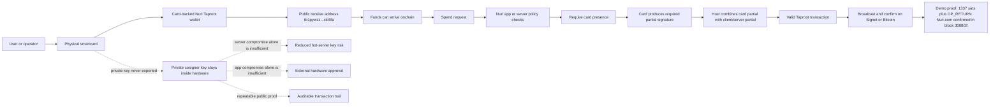

# Real Card Signet Proof

This document is the reproducible proof package for the current physical
Feitian Java Card in the Omnikey reader. It covers the Nuri MuSig2/Taproot
cosigner applet, not only the simulator.

No private material is committed here. The local card profile is intentionally
ignored by git.

## Public Account

Local project:

```text
/Users/eminmahrt/Developer/nuri-passkey-prf-smartcard
```

Local non-committed card state:

```text
.nuri-card-musig2/browser-real-card.json
```

That local profile contains the demo client secret and must not be published.
The card key was generated on-card and is non-exportable. The public identity is:

```text
network             = signet
address             = tb1pywzzgk3p7a5zhhkpqn548pm0xpqqfvzl4jylev522glcjy5npc4sckt9fa
card_pk33           = 02b9f7051445e003e60809f888ccca2057dba6609e5c5541eee64acef41ddbf034
client_pk33         = 022fd92f3a844f11bfa474e884f88630447a223e7d2705efb4100b0b96065aa064
aggregate_xonly32   = 2384245a21f7682bdec104e953876f304004b05fac89fcb28a523f8912930e2b
scriptPubKey        = 51202384245a21f7682bdec104e953876f304004b05fac89fcb28a523f8912930e2b
```

Explorer links:

- Address: <https://mempool.space/signet/address/tb1pywzzgk3p7a5zhhkpqn548pm0xpqqfvzl4jylev522glcjy5npc4sckt9fa>
- Confirmed demo transaction: <https://mempool.space/signet/tx/d9ecca378bd015f2bd39d3113d3dadc65e6b6f29b72c1d1e6a7d73f246994c38>

## Transaction Ledger

These are the onchain transactions from the successful demo. The funding
transaction is a Signet faucet batch transaction; it is included only so the
input chain can be audited. The card signature proof is the spend transaction.

| Role | Txid | Block | What To Check |
| --- | --- | ---: | --- |
| Faucet funding | `1b7e759fe7f8e9c0bdd0e13867dddafbe44cf130683747eae19c09ac2a989523` | `308801` | `vout 298` pays `204012` sats to the card aggregate Taproot address. |
| Card co-signed spend | `d9ecca378bd015f2bd39d3113d3dadc65e6b6f29b72c1d1e6a7d73f246994c38` | `308802` | `vin 0` spends faucet `vout 298`; witness contains the final Taproot Schnorr signature. |

Direct explorer links:

- Funding tx: <https://mempool.space/signet/tx/1b7e759fe7f8e9c0bdd0e13867dddafbe44cf130683747eae19c09ac2a989523>
- Card spend tx: <https://mempool.space/signet/tx/d9ecca378bd015f2bd39d3113d3dadc65e6b6f29b72c1d1e6a7d73f246994c38>

Audit commands:

```bash
curl -fsS https://mempool.space/signet/api/tx/1b7e759fe7f8e9c0bdd0e13867dddafbe44cf130683747eae19c09ac2a989523/status
curl -fsS https://mempool.space/signet/api/tx/1b7e759fe7f8e9c0bdd0e13867dddafbe44cf130683747eae19c09ac2a989523/outspend/298
curl -fsS https://mempool.space/signet/api/tx/d9ecca378bd015f2bd39d3113d3dadc65e6b6f29b72c1d1e6a7d73f246994c38/status
curl -fsS https://mempool.space/signet/api/tx/d9ecca378bd015f2bd39d3113d3dadc65e6b6f29b72c1d1e6a7d73f246994c38/hex
```

Verified API facts from 2026-06-14:

```text
funding status:
  confirmed    = true
  block_height = 308801
  block_hash   = 0000000759359116ad7075625bf1f1c7bb8b619d7eeb9a1d06f6b5548e4bcf10

funding output:
  outpoint     = 1b7e759fe7f8e9c0bdd0e13867dddafbe44cf130683747eae19c09ac2a989523:298
  value        = 204012 sats
  address      = tb1pywzzgk3p7a5zhhkpqn548pm0xpqqfvzl4jylev522glcjy5npc4sckt9fa
  scriptPubKey = 51202384245a21f7682bdec104e953876f304004b05fac89fcb28a523f8912930e2b

outspend:
  spent_by     = d9ecca378bd015f2bd39d3113d3dadc65e6b6f29b72c1d1e6a7d73f246994c38
  vin          = 0
  confirmed    = true
  block_height = 308802

card spend status:
  confirmed    = true
  block_height = 308802
  block_hash   = 000000130e5278bfe9045681c1cbc23fe3a23dc78d2d570b271730c7ba84ad29
```

## Confirmed Onchain Demo

The confirmed transaction was created by `scripts/real-bitcoin-card-demo.mjs`
and co-signed by the physical card through `scripts/real-card-cosign-proof.py`.

```text
txid        = d9ecca378bd015f2bd39d3113d3dadc65e6b6f29b72c1d1e6a7d73f246994c38
block       = 308802
block_hash  = 000000130e5278bfe9045681c1cbc23fe3a23dc78d2d570b271730c7ba84ad29
block_time  = 1781425293
fee         = 500 sats
vsize       = 173 vbytes
```

Input:

```text
1b7e759fe7f8e9c0bdd0e13867dddafbe44cf130683747eae19c09ac2a989523:298
value = 204012 sats
```

Outputs:

```text
vout 0: 1337 sats -> tb1pywzzgk3p7a5zhhkpqn548pm0xpqqfvzl4jylev522glcjy5npc4sckt9fa
vout 1: OP_RETURN "Nuri.com"
vout 2: 202175 sats change -> tb1pywzzgk3p7a5zhhkpqn548pm0xpqqfvzl4jylev522glcjy5npc4sckt9fa
```

Signature proof markers from the broadcast run:

```text
taproot_sighash32          = 6fd10ef21a5c8cfde2c59788731b86720ad45619b951407d6c534b216f66c28f
card_partial_verified      = true
final_signature_verified   = true
final_signature64          = bcb4c993055d2dce0f71ade5ac46043a01b03a7fb95fdb404c96777ad443dd4da5989272e01382c801f8ee3495ba70c19da7f96302af52a6619aba8bc2e11b58
```

Onchain witness signature:

```text
bcb4c993055d2dce0f71ade5ac46043a01b03a7fb95fdb404c96777ad443dd4da5989272e01382c801f8ee3495ba70c19da7f96302af52a6619aba8bc2e11b58
```

Raw transaction:

```text
020000000001012395982aac099ce1ea47376830f14ce4fbdadd6738e1d0bdc0e9f8e79f757e1b2a01000000ffffffff0339050000000000002251202384245a21f7682bdec104e953876f304004b05fac89fcb28a523f8912930e2b00000000000000000a6a084e7572692e636f6dbf150300000000002251202384245a21f7682bdec104e953876f304004b05fac89fcb28a523f8912930e2b0140bcb4c993055d2dce0f71ade5ac46043a01b03a7fb95fdb404c96777ad443dd4da5989272e01382c801f8ee3495ba70c19da7f96302af52a6619aba8bc2e11b5800000000
```

The Faucet transaction shown in mempool.space has hundreds of outputs because
the Signet faucet batches many payouts in one transaction. Our card spend is the
separate transaction above and has only three outputs.

## One-Command Confirmation Check

```bash
npm run bitcoin:card:status -- --txid=d9ecca378bd015f2bd39d3113d3dadc65e6b6f29b72c1d1e6a7d73f246994c38 --verbose
```

Expected result:

```text
[real-card-demo] ... checking transaction confirmation status ...
[real-card-demo] ... checked transaction status {"confirmed":true,"block_height":308802}
{
  "network": "signet",
  "txid": "d9ecca378bd015f2bd39d3113d3dadc65e6b6f29b72c1d1e6a7d73f246994c38",
  "status": {
    "confirmed": true,
    "block_height": 308802,
    "block_hash": "000000130e5278bfe9045681c1cbc23fe3a23dc78d2d570b271730c7ba84ad29",
    "block_time": 1781425293
  }
}
```

## Reproduce The Local Card Signing Demo

This signs with the physical card but does not broadcast. It is the safe demo
command to run in front of someone because it proves the real card path without
spending another UTXO.

```bash
npm run bitcoin:card:spend -- --amount-sats=1337 --op-return=Nuri.com --fee-sats=500 --verbose
```

Expected important log lines:

```text
[real-card-demo] ... loading real-card MuSig2 profile {"profile":".nuri-card-musig2/browser-real-card.json"}
[real-card-demo] ... using card/client aggregate identity ...
[real-card-demo] ... selecting spend UTXO {"explicit_utxo":false,"include_unconfirmed":false}
[real-card-demo] ... selected UTXO and outputs ...
[real-card-demo] ... computed BIP341 Taproot sighash ...
[real-card-demo] ... requesting physical card MuSig2 partial signature ...
[real-card-demo] ... card partial verified and final MuSig2 signature assembled {"card_partial_verified":true,"final_signature_verified":true,...}
[real-card-demo] ... local BIP340 verification passed ...
[real-card-demo] ... finalized signed transaction ...
```

The JSON result should contain:

```text
status: REAL_BITCOIN_CARD_TX_READY
source_address: tb1pywzzgk3p7a5zhhkpqn548pm0xpqqfvzl4jylev522glcjy5npc4sckt9fa
card_partial_verified: true
final_signature_verified: true
broadcasted: false
```

Reference transcript from 2026-06-14:

```text
$ npm run bitcoin:card:spend -- --amount-sats=1337 --op-return=Nuri.com --fee-sats=500 --verbose

[real-card-demo] 2026-06-14T08:39:08.357Z loading real-card MuSig2 profile {"profile":".nuri-card-musig2/browser-real-card.json"}
[real-card-demo] 2026-06-14T08:39:08.359Z using card/client aggregate identity {"network":"signet","source_address":"tb1pywzzgk3p7a5zhhkpqn548pm0xpqqfvzl4jylev522glcjy5npc4sckt9fa","card_pk33":"02b9f7051445e003e60809f888ccca2057dba6609e5c5541eee64acef41ddbf034","client_pk33":"022fd92f3a844f11bfa474e884f88630447a223e7d2705efb4100b0b96065aa064","aggregate_xonly32":"2384245a21f7682bdec104e953876f304004b05fac89fcb28a523f8912930e2b"}
[real-card-demo] 2026-06-14T08:39:08.359Z selecting spend UTXO {"explicit_utxo":false,"include_unconfirmed":false}
[real-card-demo] 2026-06-14T08:39:08.541Z selected UTXO and outputs {"utxo":"d9ecca378bd015f2bd39d3113d3dadc65e6b6f29b72c1d1e6a7d73f246994c38:2","input_sats":202175,"send_sats":1337,"fee_sats":500,"change_sats":200338,"op_return":"Nuri.com"}
[real-card-demo] 2026-06-14T08:39:08.544Z computed BIP341 Taproot sighash {"taproot_sighash32":"4af7aeeefdb03aeb637d463d6f5147bb339cf98becfc4c4f68bdb3af5cce5212"}
[real-card-demo] 2026-06-14T08:39:08.544Z requesting physical card MuSig2 partial signature {"python":"/private/tmp/nuri-fido2-real-card-venv/bin/python","script":"scripts/real-card-cosign-proof.py","card_pk33":"02b9f7051445e003e60809f888ccca2057dba6609e5c5541eee64acef41ddbf034"}
[real-card-demo] 2026-06-14T08:39:09.342Z card partial verified and final MuSig2 signature assembled {"card_partial_verified":true,"final_signature_verified":true,"final_signature64":"aa3590a0a89239a4074e31140906f2078750b468b67cb677413a304818da7b2ce457959b5cf6e10950c5b491a9239c8ea9488f34fe244859c5090785c785d879"}
[real-card-demo] 2026-06-14T08:39:09.358Z local BIP340 verification passed {"aggregate_xonly32":"2384245a21f7682bdec104e953876f304004b05fac89fcb28a523f8912930e2b"}
[real-card-demo] 2026-06-14T08:39:09.359Z finalized signed transaction {"txid":"c85a73fab75f8649852123d1fff336df2f098792554086a290433ce0999c3e81","tx_vsize":173,"outputs":3}
```

The final MuSig2 witness signature can differ between dry runs because the
signing session uses fresh nonces. With the same unsigned transaction, the
Bitcoin `txid` can remain the same because witness data is not part of the
legacy transaction id.

To save a review log locally:

```bash
mkdir -p logs
npm run bitcoin:card:spend -- --amount-sats=1337 --op-return=Nuri.com --fee-sats=500 --verbose 2>&1 | tee logs/real-card-signet-signing.log
```

`*.log` files are gitignored.

## Broadcast A New Demo Transaction

Only run this when the Signet UTXO balance is enough and you intentionally want
another onchain demo.

```bash
npm run bitcoin:card:spend -- --amount-sats=1337 --op-return=Nuri.com --fee-sats=500 --broadcast --wait-confirmation --verbose
```

The command does all of this:

1. Loads the local public card/client profile.
2. Fetches a confirmed Signet UTXO for the card aggregate Taproot address.
3. Builds a Taproot key-path transaction.
4. Computes the BIP341 sighash.
5. Sends that 32-byte message to the physical card applet.
6. Receives and verifies the card MuSig2 partial signature.
7. Aggregates the final BIP340 signature with the client partial.
8. Verifies the final Schnorr signature locally.
9. Inserts the signature into the Taproot witness.
10. Broadcasts to mempool.space Signet.
11. Polls until the transaction is confirmed.

## Technical Flow

```mermaid
flowchart TD
  A[Start with physical Feitian Java Card in PC/SC reader] --> B[Select Nuri MuSig2 applet AID 4E5552494D554701]
  B --> C{Card key already exists?}
  C -- no --> D[KEYGEN APDU on card]
  D --> E[Card creates non-exportable secp256k1 cosigner key]
  E --> F[Card returns only card_pk33]
  C -- yes --> F
  F --> G[Host loads local ignored profile .nuri-card-musig2/browser-real-card.json]
  G --> H[Profile provides demo client key and public card/client metadata]
  H --> I[Host computes MuSig2 aggregate key]
  I --> J[aggregate_xonly32 2384245a...930e2b]
  J --> K[Build P2TR scriptPubKey 5120238424...930e2b]
  K --> L[Derive Signet address tb1pywzz...ckt9fa]
  L --> M[Fetch confirmed UTXOs from mempool.space Signet API]
  M --> N[Use faucet output 1b7e75...9523:298, value 204012 sats]
  N --> O[Build unsigned Taproot key-path tx]
  O --> P[Outputs: 1337 sats to card address]
  O --> Q[Output: OP_RETURN Nuri.com]
  O --> R[Change: 202175 sats back to card address]
  P --> S[Compute BIP341 Taproot sighash]
  Q --> S
  R --> S
  S --> T[msg32 6fd10e...6c28f]
  T --> U[Host asks card for MuSig2 partialSign APDU]
  U --> V[Card signs msg32 internally with non-exportable card key]
  V --> W[Card returns card partial signature only]
  W --> X[Host verifies card partial against card_pk33 and session]
  X --> Y{card_partial_verified?}
  Y -- false --> Z[Abort, do not finalize or broadcast]
  Y -- true --> AA[Host creates client partial signature]
  AA --> AB[Aggregate card partial and client partial]
  AB --> AC[Final 64-byte BIP340 Schnorr signature]
  AC --> AD[Verify final signature against aggregate_xonly32 and msg32]
  AD --> AE{final_signature_verified?}
  AE -- false --> Z
  AE -- true --> AF[Insert final signature into Taproot witness]
  AF --> AG[Finalize raw transaction]
  AG --> AH[Broadcast raw tx to mempool.space Signet API]
  AH --> AI[Accepted txid d9ecca...4c38]
  AI --> AJ[Wait for confirmation]
  AJ --> AK[Confirmed in Signet block 308802]
  AK --> AL[Auditable onchain hardware-cosigned Taproot spend]
```



## User And Product Flow



The product meaning is: this wallet identity exists because the card key is part
of the aggregate Taproot key. A valid spend requires the card-side partial
signature. The current demo runs on Signet, but the signing primitive is the same
Taproot key-path signature model used on Bitcoin mainnet.

## What This Proves

- The card-generated MuSig2 key is part of the Taproot aggregate key.
- The physical card produced a valid MuSig2 partial signature for the real
  Bitcoin Taproot sighash.
- The host verified the card partial and final aggregate BIP340 signature.
- The resulting transaction was accepted by Signet and confirmed in block
  `308802`.

## What This Does Not Prove Yet

- It does not yet prove production Arkade policy integration.
- It does not yet prove a mobile NFC Taproot signing UX.
- It does not yet replace the current Nuri server cosigner for existing wallets,
  because existing wallets use their existing aggregate keys.

The clean production path is to create new wallets whose cosigner key is the
card public key from the beginning, or to define an explicit server-or-card
policy during wallet creation.
